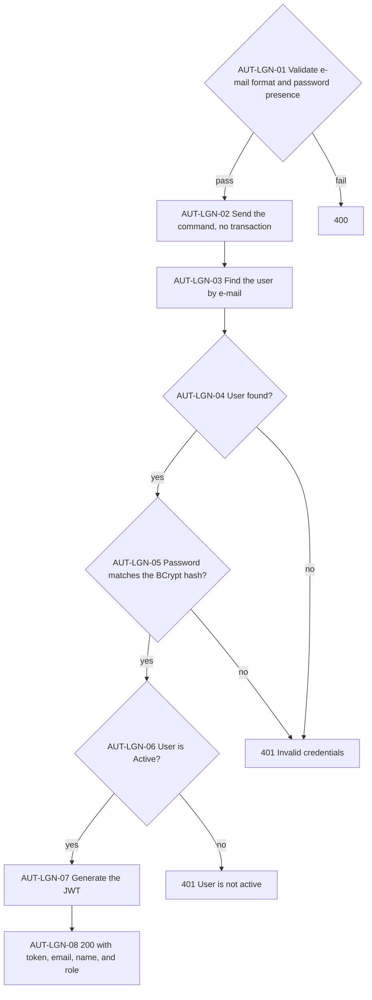
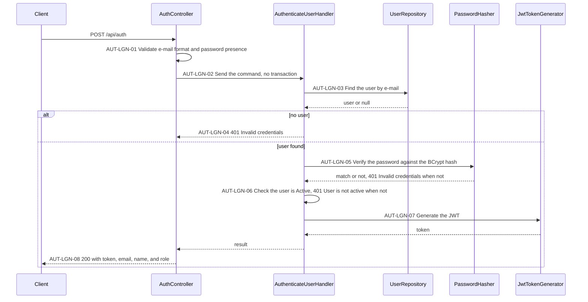

# Auth API

Exchanges an e-mail and password for a JWT that the other APIs require.

> Work item: TD-024 · Key: AUT · Routes: `/api/auth`

## Endpoints

| Topic | Method | Route | Roles | Success | Errors |
|---|---|---|---|---|---|
| AUT-LGN | POST | `/api/auth` | anonymous | 200 | 400, 401 |

## Data model

Reads `Users` (see [users.md](users.md#data-model)): `Email`, the BCrypt `Password` hash, `Status`, and `Role`.

## AUT-LGN — Log in

Checks the credentials and the user's status, then issues a token valid for 8 hours. Every failure answers 401 without saying which check failed.

**Source:** `backend/src/Ambev.DeveloperEvaluation.WebApi/Features/Auth/AuthController.cs`, `backend/src/Ambev.DeveloperEvaluation.Application/Auth/AuthenticateUser/AuthenticateUserHandler.cs`, `backend/src/Ambev.DeveloperEvaluation.Common/Security/JwtTokenGenerator.cs`

- AUT-LGN-04 and AUT-LGN-05: both failures return the same message, so the response does not reveal whether the e-mail exists; the warning log carries the user id, never the e-mail.
- AUT-LGN-06: Inactive and Suspended users get 401 even with the right password.
- AUT-LGN-07: claims `nameid` (user id), `unique_name` (username), and `role`; signed with HMAC-SHA256 and `Jwt:SecretKey`; valid for 8 hours; there is no refresh token.

## Known limitations

- No refresh token and no logout.
- A token stays valid for its 8 hours after the user is deleted or deactivated.

## See also

- [conventions.md](conventions.md#cmn-aut--authentication-and-roles): how the token is validated
- [users.md](users.md)
- [INDEX.md](INDEX.md)
