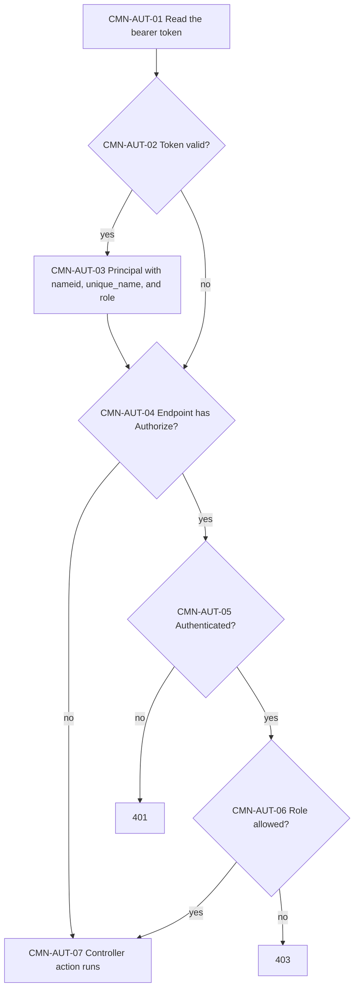
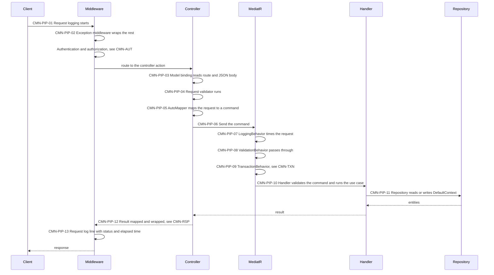
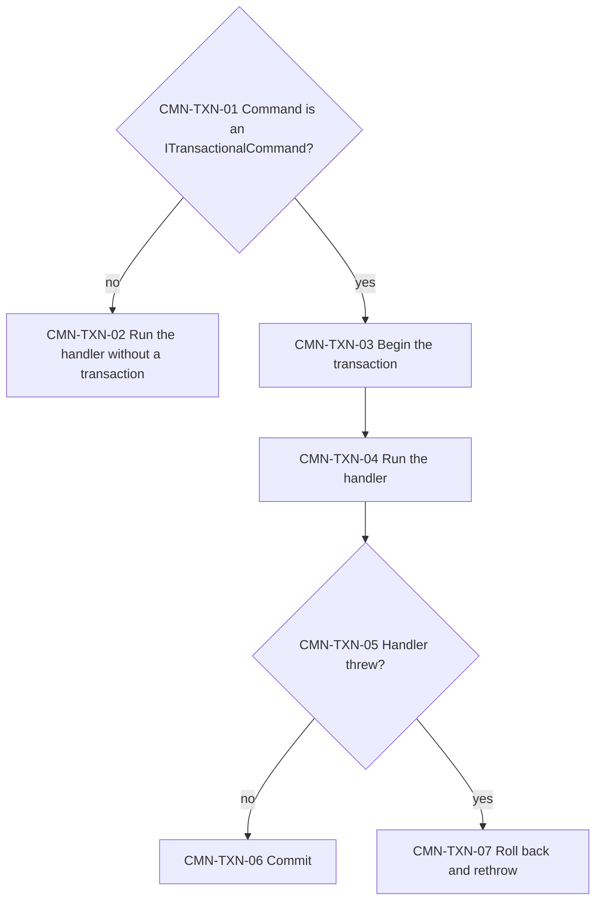
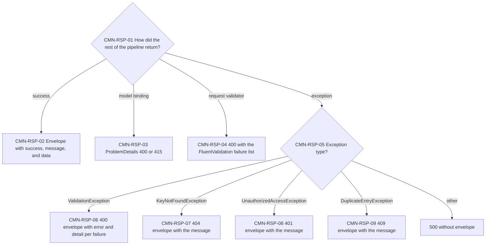
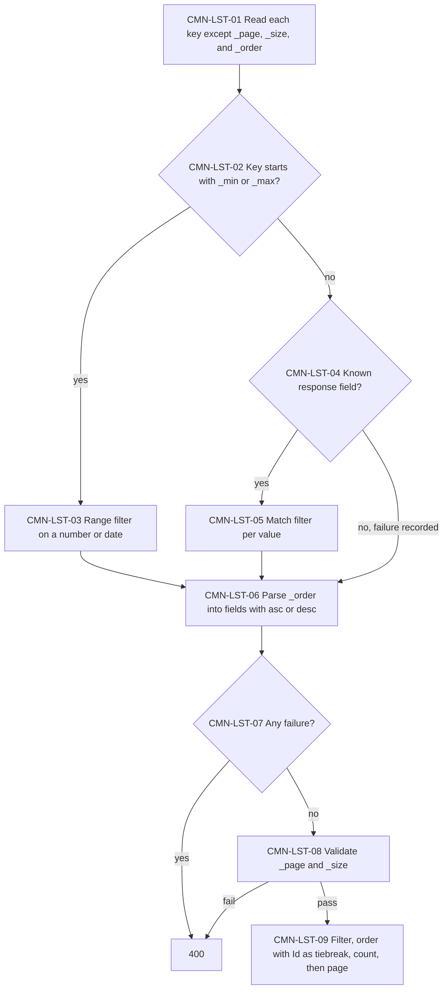
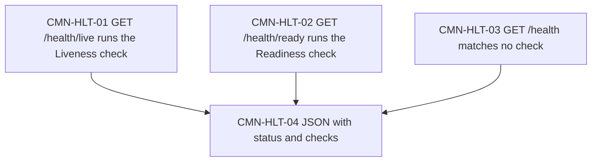

# Conventions

What every API shares: authentication, the request path, transactions, responses and errors, list queries, and health checks.

> Work item: TD-023 · Key: CMN

## CMN-AUT — Authentication and roles

Every request passes through JWT bearer authentication; controllers decide with `[Authorize]` whether a token is required and which roles may write.

**Source:** `backend/src/Ambev.DeveloperEvaluation.Common/Security/AuthenticationExtension.cs`, `backend/src/Ambev.DeveloperEvaluation.Common/Security/JwtTokenGenerator.cs`, `backend/src/Ambev.DeveloperEvaluation.WebApi/Program.cs`

- CMN-AUT-02: the signature (HMAC-SHA256 with `Jwt:SecretKey`) and the lifetime are validated with zero clock skew; issuer and audience are not.
- CMN-AUT-04: the sales, customers, branches, and products controllers require a token for every action; the auth and users controllers require none (users: BUG-012).
- CMN-AUT-06: writes (POST, PUT, DELETE) require Admin or Manager; reads accept any authenticated role, Customer included.

## CMN-PIP — Request pipeline

Every endpoint follows the same path from middleware to repository. The API documents refer to this topic instead of redrawing it.

**Source:** `backend/src/Ambev.DeveloperEvaluation.WebApi/Program.cs`, `backend/src/Ambev.DeveloperEvaluation.Common/Logging/LoggingExtension.cs`, `backend/src/Ambev.DeveloperEvaluation.WebApi/Middleware/ValidationExceptionMiddleware.cs`, `backend/src/Ambev.DeveloperEvaluation.Application/Common/LoggingBehavior.cs`, `backend/src/Ambev.DeveloperEvaluation.Common/Validation/ValidationBehavior.cs`, `backend/src/Ambev.DeveloperEvaluation.Application/Common/TransactionBehavior.cs`

- CMN-PIP-03: a malformed body or a wrong content type never reaches the controller (CMN-RSP).
- CMN-PIP-08: no FluentValidation validator is registered in DI, so validation runs in CMN-PIP-04 and again in CMN-PIP-10 instead (TD-003).
- CMN-PIP-07: rejections (validation, not found, duplicate, unauthorized) are logged as warnings with the exception type only; any other failure is logged as an error.
- CMN-PIP-13: MongoDB stores the line as `HTTP "POST" "/api/sales" responded 201 in 12.3456 ms`, and the console prints it without the quotes; health checks answering 200 are filtered out by the Serilog filter in `appsettings.json`.

## CMN-TXN — Transactions

Every write command runs inside one database transaction, so all of its saves commit or roll back together. Reads and login run without one.

**Source:** `backend/src/Ambev.DeveloperEvaluation.Application/Common/TransactionBehavior.cs`, `backend/src/Ambev.DeveloperEvaluation.Application/Common/ITransactionalCommand.cs`, `backend/src/Ambev.DeveloperEvaluation.ORM/UnitOfWork.cs`

- CMN-TXN-01: the create and delete commands of users and the create, update, and delete commands of customers, branches, products, and sales implement it.
- CMN-TXN-04: repository saves inside the handler join this transaction, so a sale and its outbox rows commit together (SAL-OBW).
- CMN-TXN-07: the rollback ignores the request's cancellation, so an aborted request still releases the transaction.

## CMN-RSP — Responses and errors

Successful responses share one envelope; errors take one of three shapes depending on where the request stopped.

**Source:** `backend/src/Ambev.DeveloperEvaluation.WebApi/Middleware/ValidationExceptionMiddleware.cs`, `backend/src/Ambev.DeveloperEvaluation.WebApi/Common/BaseController.cs`, `backend/src/Ambev.DeveloperEvaluation.WebApi/Common/ApiResponse.cs`, `backend/src/Ambev.DeveloperEvaluation.WebApi/Common/PaginatedResponse.cs`, `backend/src/Ambev.DeveloperEvaluation.Common/Validation/ValidationErrorDetail.cs`

- CMN-RSP-02: lists add `currentPage`, `totalPages`, and `totalCount` to the envelope.
- CMN-RSP-03: a malformed JSON body gives 400 and a missing or wrong `Content-Type` gives 415, both as ProblemDetails.
- CMN-RSP-04: this body is the raw failure list (`propertyName`, `errorMessage`, and more), not the envelope.
- CMN-RSP-05: the 401 and 403 of CMN-AUT come from the authentication middleware with an empty body; the `{ type, error, detail }` body of `.doc/general-api.md` is not produced.

## CMN-LST — List queries

Every list endpoint turns its query string into filters, an order, and a page. Field names are the response's JSON names, case-insensitive.

**Source:** `backend/src/Ambev.DeveloperEvaluation.WebApi/Common/ListQueryParser.cs`, `backend/src/Ambev.DeveloperEvaluation.ORM/Repositories/ListQueryExtensions.cs`, `backend/src/Ambev.DeveloperEvaluation.WebApi/Common/PaginatedList.cs`

- CMN-LST-03: each `_min` or `_max` key appears once; a date given as `yyyy-MM-dd` in `_max` includes the whole day.
- CMN-LST-05: text fields match case-insensitively with `*` allowed only at the start or the end; other types match exactly; a day matches the whole day; a repeated key matches any of its values, up to 50.
- CMN-LST-07: a bad filter or order throws `ValidationException` and gets the envelope (CMN-RSP-06); a bad `_page` or `_size` fails in CMN-LST-08 and gets the raw failure list (CMN-RSP-04).
- CMN-LST-08: `_page` is at least 1 and `_size` is from 1 to 100 (defaults 1 and 10).
- CMN-LST-09: a page past the end returns an empty list with the real total count.

## CMN-HLT — Health checks

Three anonymous endpoints report whether the process is up. They do not probe PostgreSQL or MongoDB.

**Source:** `backend/src/Ambev.DeveloperEvaluation.Common/HealthChecks/HealthChecksExtension.cs`

- CMN-HLT-01 and CMN-HLT-02: both checks always report Healthy.
- CMN-HLT-03: `/health` reports Healthy with an empty check list.
- CMN-HLT-04: Healthy and Degraded give 200 and Unhealthy gives 503.

## Known limitations

- No validator is registered in DI, so `ValidationBehavior` does nothing (TD-003).
- Errors come in three shapes; the challenge's `{ type, error, detail }` body is not produced.
- Health checks do not probe PostgreSQL or MongoDB.
- An unexpected exception returns 500 without the envelope.

## See also

- [INDEX.md](INDEX.md)
- [README_.md](../../README_.md): running and configuring the API
- [general-api.md](../../.doc/general-api.md): the challenge's target conventions
