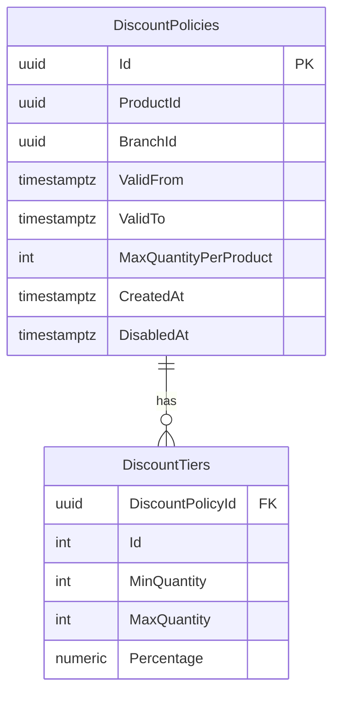
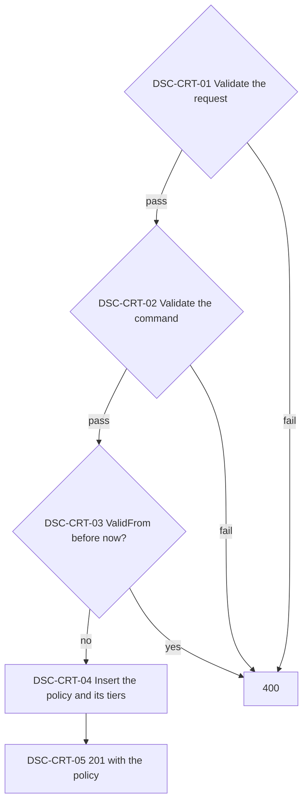
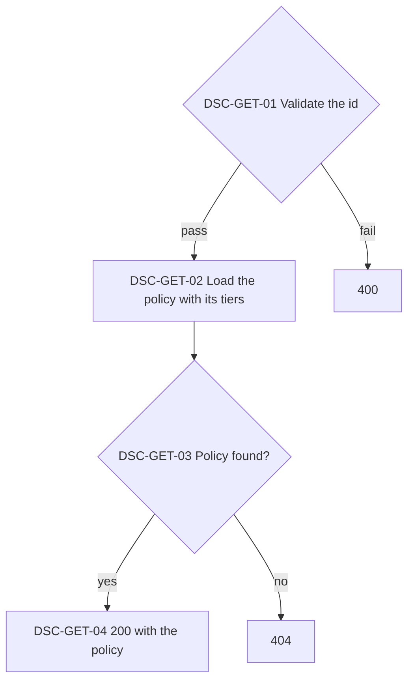
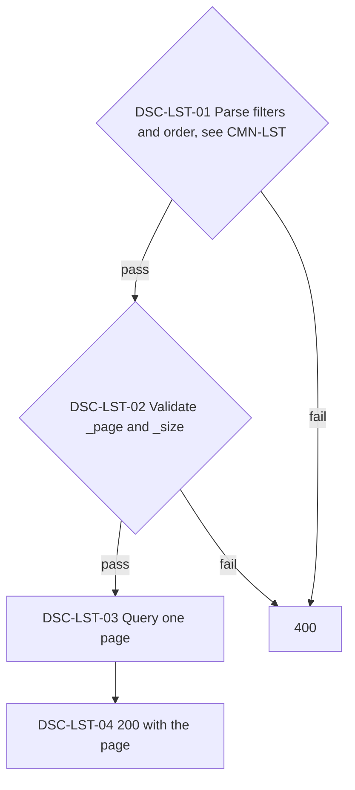
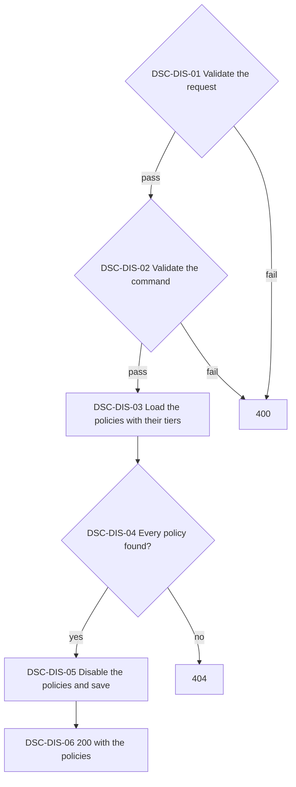

# Discount Policies API

Discount rules as data: a maximum per product and a discount ceiling per quantity tier, scoped to a product, a branch, both, or neither, for a validity period. Sales read them at their sale date (SAL-CRT, SAL-UPD).

> Work item: FEAT-001, TD-032 · Key: DSC · Routes: `/api/discount-policies`

## Endpoints

| Topic | Method | Route | Roles | Success | Errors |
|---|---|---|---|---|---|
| DSC-CRT | POST | `/api/discount-policies` | Admin, Manager | 201 | 400, 401, 403 |
| DSC-GET | GET | `/api/discount-policies/{id}` | any authenticated | 200 | 400, 401, 404 |
| DSC-LST | GET | `/api/discount-policies` | any authenticated | 200 | 400, 401 |
| DSC-DIS | POST | `/api/discount-policies/disable` | Admin, Manager | 200 | 400, 401, 403, 404 |

## Data model

- `ProductId` and `BranchId` are external identities with no foreign key; null means every product or every branch, and both null is a default policy.
- `ValidFrom` is inclusive and `ValidTo` exclusive; a null `ValidTo` never ends. Check constraints: `ValidTo` later than `ValidFrom`, `MaxQuantityPerProduct` above zero, `MinQuantity` at least 1, `MaxQuantity` null or not below `MinQuantity`, `Percentage` above 0 and at most 100 (`numeric(5,2)`).
- `DisabledAt` is null while the policy is active; once set it never changes (DSC-DIS). Migration `AddDiscountPolicyDisabledAt` adds it.
- A tier's key is `(DiscountPolicyId, Id)`; tiers belong to their policy and are never shared.
- The index on `(ProductId, BranchId, ValidFrom)` serves the policy lookup of SAL-CRT and SAL-UPD.
- Migration `AddDiscountPolicies` seeds the default policy `7d0c5a6e-2f4b-4c1d-9a39-0f6f2b8a1c01`: every product and branch, from 2026-01-01T00:00:00Z with no end, at most 20 units, 4 to 9 units 10%, 10 to 20 units 20% (the README rules). Its `CreatedAt` equals its `ValidFrom`.
- Each sale item keeps the id of the policy that priced it and the ceiling it allowed (see sales.md, Data model).

## DSC-CRT — Create a discount policy

Stores a new policy. Policies are never edited afterwards, only disabled (DSC-DIS): a new rule is a new policy, which wins over an older one of the same scope once it starts.

**Source:** `backend/src/Ambev.DeveloperEvaluation.WebApi/Features/DiscountPolicies/DiscountPoliciesController.cs`, `backend/src/Ambev.DeveloperEvaluation.Application/DiscountPolicies/CreateDiscountPolicy/CreateDiscountPolicyHandler.cs`, `backend/src/Ambev.DeveloperEvaluation.ORM/Repositories/DiscountPolicyRepository.cs`

- DSC-CRT-01: `productId` and `branchId` are null or a non-empty id; `validFrom` is required and `validTo`, when sent, is later (`error` = `ValidToNotAfterValidFrom`); both are UTC and end in `Z` (`error` = `NotUtc`); `maxQuantityPerProduct` is above zero; each tier has `minQuantity` of at least 1, `maxQuantity` null or not below `minQuantity`, and `percentage` above 0 and at most 100 with at most two decimals; the tiers are sorted by `minQuantity`, do not overlap, and stay within `maxQuantityPerProduct` (`error` = `InvalidTierSet`). Gaps between tiers are allowed and mean no discount; an empty tier list means only the maximum applies.
- DSC-CRT-03: `validFrom` may equal the server's current time but not precede it (`error` = `ValidFromInPast`), so a sale already made is never repriced by a new policy.
- DSC-CRT-04: `createdAt` is the server's UTC time truncated to microseconds. Overlapping policies of one scope are allowed: a sale (SAL-CRT, SAL-UPD) takes the one that started last, then the one created last, then the one with the highest id.

## DSC-GET — Get a discount policy

Returns one policy with its tiers.

**Source:** `backend/src/Ambev.DeveloperEvaluation.WebApi/Features/DiscountPolicies/DiscountPoliciesController.cs`, `backend/src/Ambev.DeveloperEvaluation.Application/DiscountPolicies/GetDiscountPolicy/GetDiscountPolicyHandler.cs`

- DSC-GET-04: tiers come ordered by `minQuantity`; a disabled policy is still returned, with `disabledAt` set (null while active).

## DSC-LST — List discount policies

Returns policies one page at a time, each with its tiers, with the list conventions of CMN-LST.

**Source:** `backend/src/Ambev.DeveloperEvaluation.WebApi/Features/DiscountPolicies/DiscountPoliciesController.cs`, `backend/src/Ambev.DeveloperEvaluation.Application/DiscountPolicies/ListDiscountPolicies/ListDiscountPoliciesHandler.cs`, `backend/src/Ambev.DeveloperEvaluation.ORM/Repositories/DiscountPolicyRepository.cs`

- DSC-LST-01: the fields are `id`, `productId`, `branchId`, `validFrom`, and `createdAt`; `validFrom` and `createdAt` also accept `_min` and `_max`. `productId` and `branchId` match an id and never the null scope. `includeDisabled` is not a field: `true` lists disabled policies too, `false` or no key (the default) leaves them out before the filters apply, and any other value, or the key twice, is 400 `InvalidValue`.
- DSC-LST-03: the default order is `validFrom`, then id.

## DSC-DIS — Disable discount policies

Takes policies out of the resolution of sales, all or nothing. It is the only change a policy accepts after creation; the discounts already stored on sale items stay as they are.

**Source:** `backend/src/Ambev.DeveloperEvaluation.WebApi/Features/DiscountPolicies/DiscountPoliciesController.cs`, `backend/src/Ambev.DeveloperEvaluation.Application/DiscountPolicies/DisableDiscountPolicies/DisableDiscountPoliciesHandler.cs`, `backend/src/Ambev.DeveloperEvaluation.ORM/Repositories/DiscountPolicyRepository.cs`

- DSC-DIS-01: the body is `{ "ids": [...] }` with at least one id (`error` = `IdsRequired`), none empty (`EmptyId`), and none repeated (`DuplicateId`).
- DSC-DIS-04: all or nothing: one unknown id answers 404, the message lists every unknown id, and no policy is disabled.
- DSC-DIS-05: `disabledAt` is the server's UTC time truncated to microseconds, the same for every policy of the request. A policy already disabled keeps its first `disabledAt`, so repeating a request is harmless. Disabling is not reversible; to bring a rule back, create a new policy.
- DSC-DIS-05: from then on SAL-CRT and SAL-UPD skip the policy, recalculations of older sales included. Disabling the default policy without another policy covering every product and branch makes those sales answer 400 `NoDiscountPolicy`.
- DSC-DIS-06: the response lists the policies in the order of `ids`, each with its tiers and `disabledAt`.

## Known limitations

- A policy cannot be edited or deleted, and disabling is not reversible; to change a rule, create a policy of the same scope that starts later.
- The list cannot select policies whose product or branch is null.
- The scope ids are not checked against the catalogs: a policy for an unknown product is stored and never applies.
- Every sale write reads the policies from the database; there is no cache.
- `CreatedAt` and `DisabledAt` are the only audit columns (TD-033).

## See also

- [sales.md](sales.md#sal-crt--create-a-sale): how a sale resolves and applies the policies
- [conventions.md](conventions.md#cmn-lst--list-queries): filters, order, and pages
- [INDEX.md](INDEX.md)
