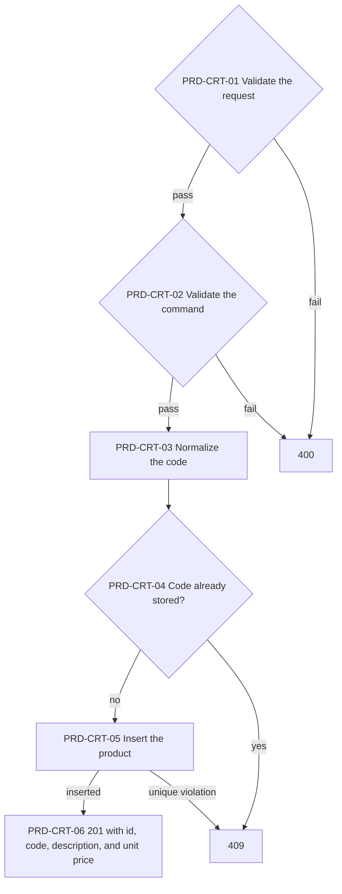
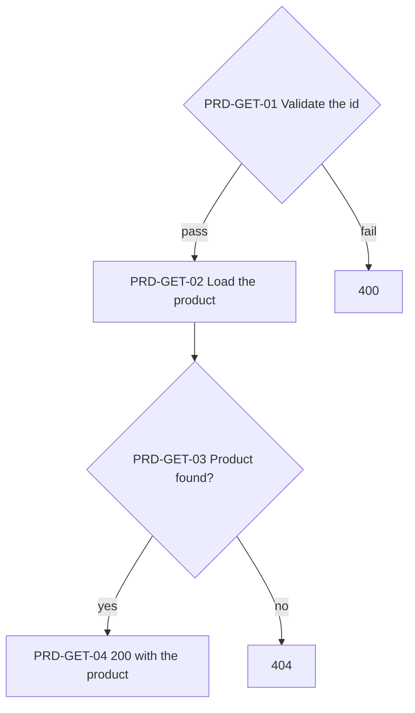
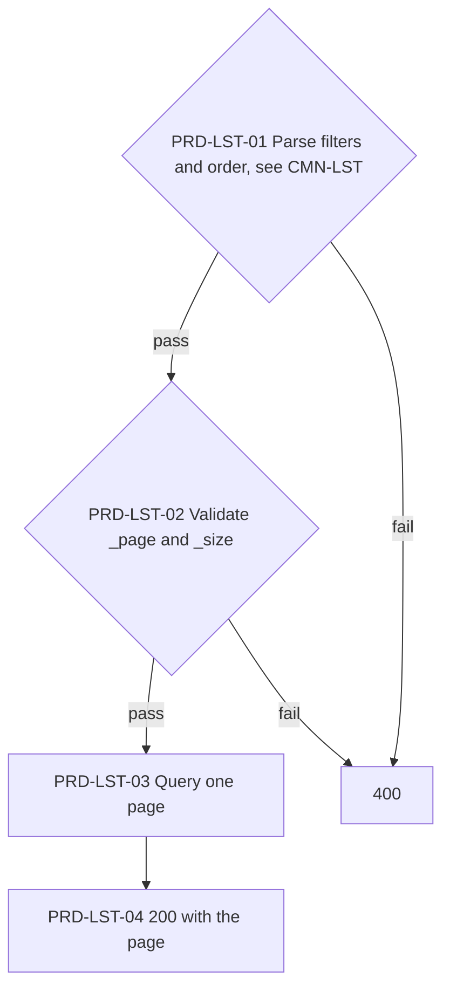
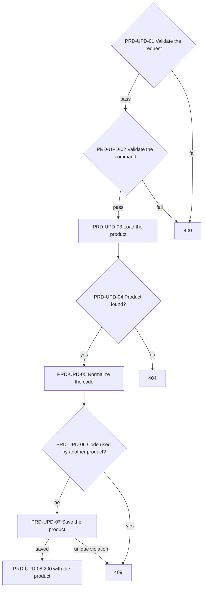
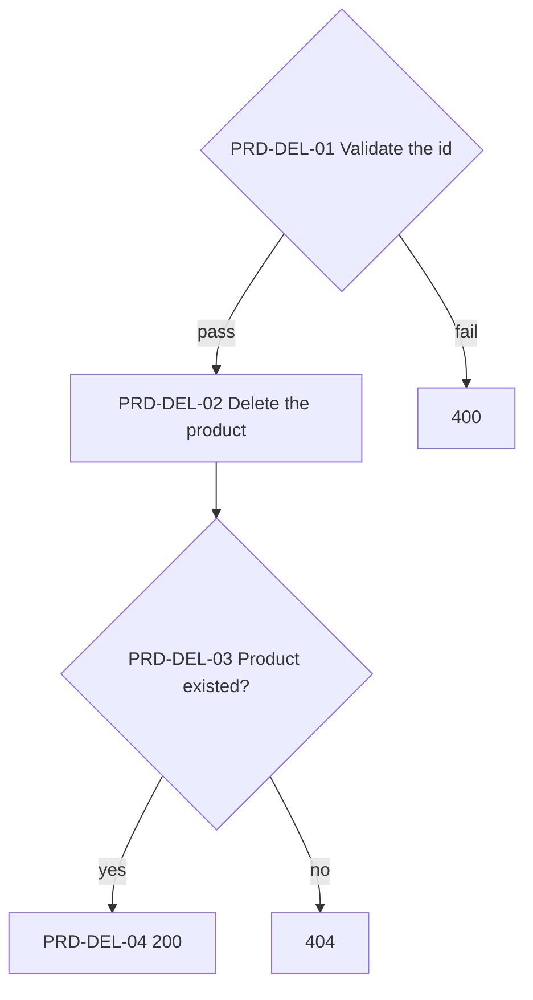

# Products API

The product catalog. Sales reference products by id and copy their description and unit price.

> Work item: TD-028 · Key: PRD · Routes: `/api/products`

## Endpoints

| Topic | Method | Route | Roles | Success | Errors |
|---|---|---|---|---|---|
| PRD-CRT | POST | `/api/products` | Admin, Manager | 201 | 400, 401, 403, 409 |
| PRD-GET | GET | `/api/products/{id}` | any authenticated | 200 | 400, 401, 404 |
| PRD-LST | GET | `/api/products` | any authenticated | 200 | 400, 401 |
| PRD-UPD | PUT | `/api/products/{id}` | Admin, Manager | 200 | 400, 401, 403, 404, 409 |
| PRD-DEL | DELETE | `/api/products/{id}` | Admin, Manager | 200 | 400, 401, 403, 404 |

## Data model

- `Code`: at most 50 characters, stored trimmed and uppercase; unique index.
- `Description`: required, at most 200 characters.
- `UnitPrice`: greater than zero, at most two decimals (`numeric(18,2)`).

## PRD-CRT — Create a product

Stores a new product. The code is trimmed and uppercased first, so codes are unique regardless of case.

**Source:** `backend/src/Ambev.DeveloperEvaluation.WebApi/Features/Products/ProductsController.cs`, `backend/src/Ambev.DeveloperEvaluation.Application/Products/CreateProduct/CreateProductHandler.cs`, `backend/src/Ambev.DeveloperEvaluation.ORM/Repositories/ProductRepository.cs`

- PRD-CRT-05: two concurrent requests with one code both pass PRD-CRT-04; the unique index turns the second into a 409.

## PRD-GET — Get a product

Returns one product by id.

**Source:** `backend/src/Ambev.DeveloperEvaluation.WebApi/Features/Products/ProductsController.cs`, `backend/src/Ambev.DeveloperEvaluation.Application/Products/GetProduct/GetProductHandler.cs`

## PRD-LST — List products

Returns products one page at a time with the list conventions of CMN-LST.

**Source:** `backend/src/Ambev.DeveloperEvaluation.WebApi/Features/Products/ProductsController.cs`, `backend/src/Ambev.DeveloperEvaluation.Application/Products/ListProducts/ListProductsHandler.cs`, `backend/src/Ambev.DeveloperEvaluation.ORM/Repositories/ProductRepository.cs`

- PRD-LST-01: the fields are `id`, `code`, `description`, and `unitPrice`; `unitPrice` also accepts `_minUnitPrice` and `_maxUnitPrice`.
- PRD-LST-03: the default order is description, then id.

## PRD-UPD — Update a product

Replaces a product's code, description, and unit price. Sales keep the description and price they copied.

**Source:** `backend/src/Ambev.DeveloperEvaluation.WebApi/Features/Products/ProductsController.cs`, `backend/src/Ambev.DeveloperEvaluation.Application/Products/UpdateProduct/UpdateProductHandler.cs`, `backend/src/Ambev.DeveloperEvaluation.ORM/Repositories/ProductRepository.cs`

- PRD-UPD-07: a new price applies only to sales and items written afterwards; existing items keep their copied price (SAL-UPD-07).

## PRD-DEL — Delete a product

Deletes one product by id. Sale items that reference it are untouched.

**Source:** `backend/src/Ambev.DeveloperEvaluation.WebApi/Features/Products/ProductsController.cs`, `backend/src/Ambev.DeveloperEvaluation.Application/Products/DeleteProduct/DeleteProductHandler.cs`

- PRD-DEL-02: no foreign key points to products, so sale items never block the delete and keep the copied description and price.

## Known limitations

- Deleting a product leaves sale items pointing to an id that no longer exists.

## See also

- [conventions.md](conventions.md#cmn-lst--list-queries): filters, order, and pages
- [conventions.md](conventions.md#cmn-pip--request-pipeline): the path every request follows
- [INDEX.md](INDEX.md)
