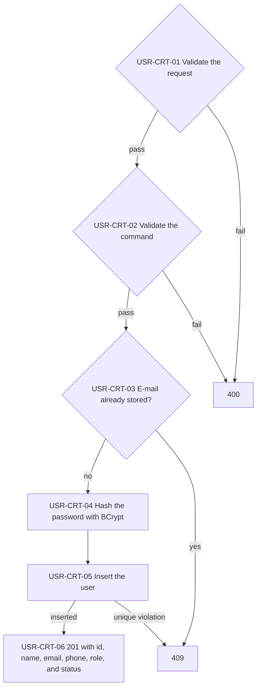
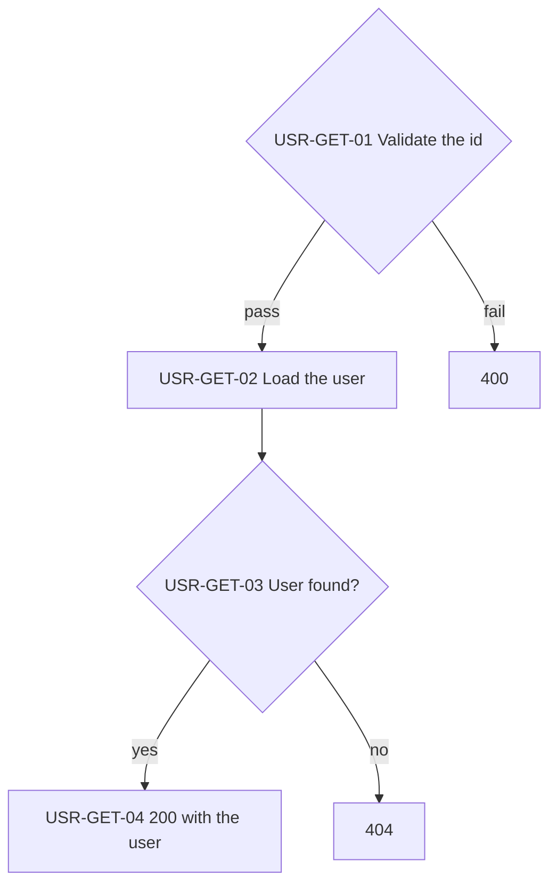
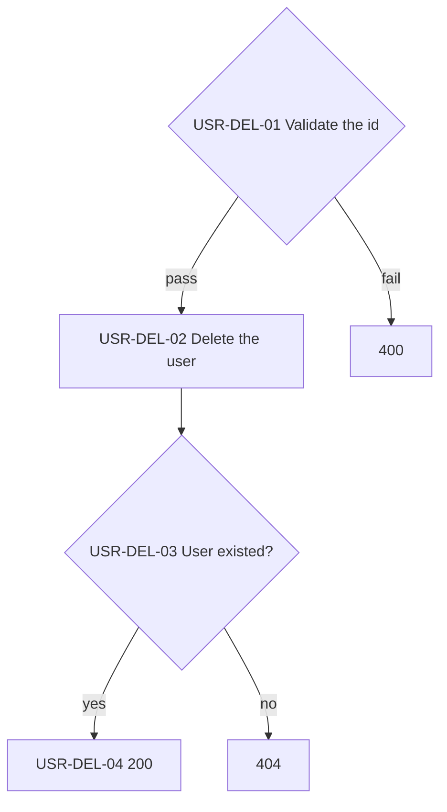

# Users API

Signs up, reads, and deletes users. Any user can then log in through the Auth API.

> Work item: TD-025 · Key: USR · Routes: `/api/users`

## Endpoints

| Topic | Method | Route | Roles | Success | Errors |
|---|---|---|---|---|---|
| USR-CRT | POST | `/api/users` | anonymous | 201 | 400, 409 |
| USR-GET | GET | `/api/users/{id}` | anonymous (BUG-012) | 200 | 400, 404 |
| USR-DEL | DELETE | `/api/users/{id}` | anonymous (BUG-012) | 200 | 400, 404 |

## Data model

- `Email`: unique index; a second user with the same e-mail is a 409.
- `Password`: stored as a BCrypt hash and never returned.
- `Username` 3 to 50 characters, `Phone` in E.164 form, `Status` not Unknown, `Role` not None.

## USR-CRT — Create a user

Stores a new user with a hashed password. The caller chooses the status and the role.

**Source:** `backend/src/Ambev.DeveloperEvaluation.WebApi/Features/Users/UsersController.cs`, `backend/src/Ambev.DeveloperEvaluation.Application/Users/CreateUser/CreateUserHandler.cs`, `backend/src/Ambev.DeveloperEvaluation.ORM/Repositories/UserRepository.cs`

- USR-CRT-01: the e-mail must be valid; the password needs at least 8 characters with an uppercase letter, a lowercase letter, a digit, and one of `! ? * . @ # $ % ^ & + =`.
- USR-CRT-05: two concurrent sign-ups with one e-mail both pass USR-CRT-03; the unique index turns the second into a 409.
- USR-CRT-06: the caller may choose any role, Admin included (BUG-012).

## USR-GET — Get a user

Returns one user by id, without the password.

**Source:** `backend/src/Ambev.DeveloperEvaluation.WebApi/Features/Users/UsersController.cs`, `backend/src/Ambev.DeveloperEvaluation.Application/Users/GetUser/GetUserHandler.cs`

## USR-DEL — Delete a user

Deletes one user by id. Tokens already issued to it stay valid until they expire.

**Source:** `backend/src/Ambev.DeveloperEvaluation.WebApi/Features/Users/UsersController.cs`, `backend/src/Ambev.DeveloperEvaluation.Application/Users/DeleteUser/DeleteUserHandler.cs`

## Known limitations

- All three endpoints accept anonymous requests, and sign-up lets the caller pick any role (BUG-012).
- There is no list or update endpoint.
- Deleting a user does not revoke its tokens.

## See also

- [auth.md](auth.md)
- [conventions.md](conventions.md#cmn-pip--request-pipeline): the path every request follows
- [INDEX.md](INDEX.md)
