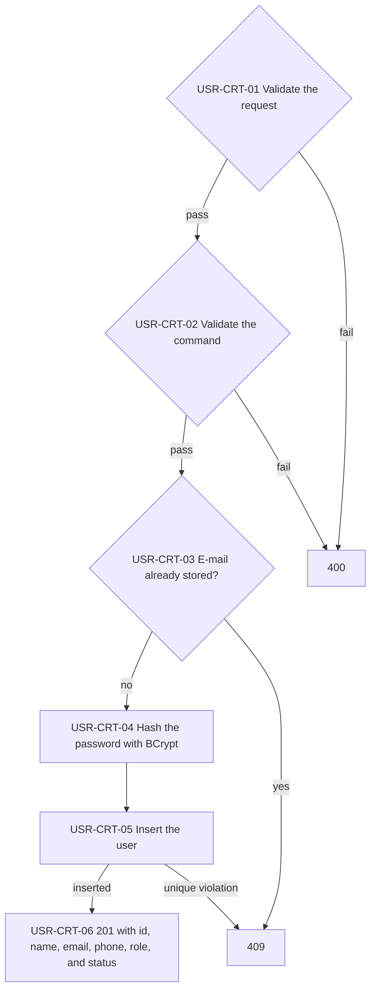
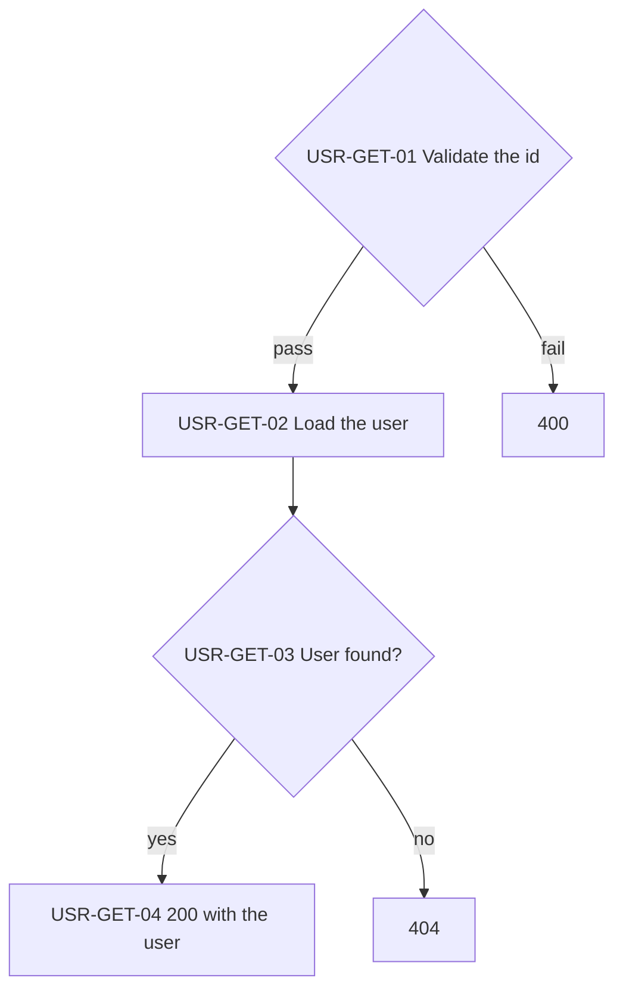
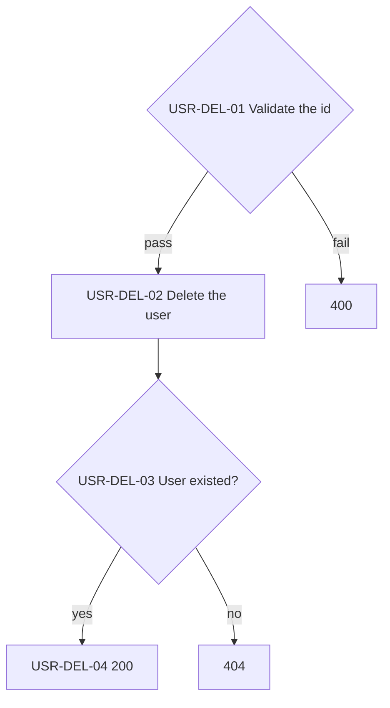
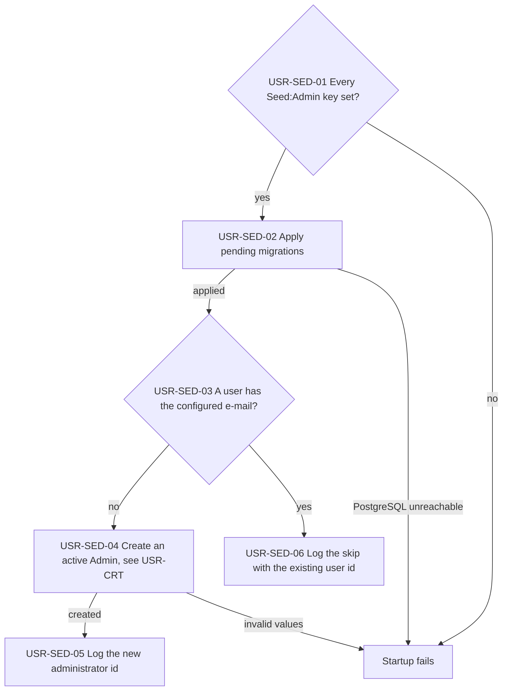

# Users API

Creates, reads, and deletes users; every call needs an Admin or Manager token. The API seeds the first Admin at startup.

> Work item: TD-025 · Key: USR · Routes: `/api/users`

## Endpoints

| Topic | Method | Route | Roles | Success | Errors |
|---|---|---|---|---|---|
| USR-CRT | POST | `/api/users` | Admin, Manager | 201 | 400, 401, 403, 409 |
| USR-GET | GET | `/api/users/{id}` | Admin, Manager | 200 | 400, 401, 403, 404 |
| USR-DEL | DELETE | `/api/users/{id}` | Admin, Manager | 200 | 400, 401, 403, 404 |

## Data model

- `Email`: unique index; a second user with the same e-mail is a 409.
- `Password`: stored as a BCrypt hash and never returned.
- `Username` 3 to 50 characters, `Phone` in E.164 form, `Status` not Unknown, `Role` not None.

## USR-CRT — Create a user

Stores a new user with a hashed password. The caller chooses the status and the role, Admin included.

**Source:** `backend/src/Ambev.DeveloperEvaluation.WebApi/Features/Users/UsersController.cs`, `backend/src/Ambev.DeveloperEvaluation.Application/Users/CreateUser/CreateUserHandler.cs`, `backend/src/Ambev.DeveloperEvaluation.ORM/Repositories/UserRepository.cs`

- USR-CRT-01: the e-mail must be valid; the password needs at least 8 characters with an uppercase letter, a lowercase letter, a digit, and one of `! ? * . @ # $ % ^ & + =`.
- USR-CRT-05: two concurrent creates with one e-mail both pass USR-CRT-03; the unique index turns the second into a 409.

## USR-GET — Get a user

Returns one user by id, without the password.

**Source:** `backend/src/Ambev.DeveloperEvaluation.WebApi/Features/Users/UsersController.cs`, `backend/src/Ambev.DeveloperEvaluation.Application/Users/GetUser/GetUserHandler.cs`

## USR-DEL — Delete a user

Deletes one user by id. Tokens already issued to it stay valid until they expire.

**Source:** `backend/src/Ambev.DeveloperEvaluation.WebApi/Features/Users/UsersController.cs`, `backend/src/Ambev.DeveloperEvaluation.Application/Users/DeleteUser/DeleteUserHandler.cs`

## USR-SED — Seed the administrator

Creates the first Admin before the API listens, since no anonymous call can create users. It runs on every start and skips when the user exists.

**Source:** `backend/src/Ambev.DeveloperEvaluation.WebApi/Seeding/SeedingExtensions.cs`, `backend/src/Ambev.DeveloperEvaluation.WebApi/Seeding/AdminSeedSettings.cs`, `backend/src/Ambev.DeveloperEvaluation.WebApi/Seeding/AdminSeeder.cs`, `backend/src/Ambev.DeveloperEvaluation.WebApi/Program.cs`

- USR-SED-01: `Seed:Admin:Username`, `Email`, `Password`, and `Phone`, read before the app is built; the startup error names the missing key.
- USR-SED-02: runs before the host starts, so the outbox relay and the endpoints never meet a database without its tables; the compose API waits for the PostgreSQL healthcheck.
- USR-SED-03: only the e-mail is compared, so a restart skips the seed even after that user's role or password changed.
- USR-SED-04: the values pass the same rules as any new user; a weak password or a bad phone stops startup.
- USR-SED-05 and USR-SED-06: the log carries the user id, never the e-mail.

## Known limitations

- Admin and Manager have the same powers: either can create or delete any user, Admin included.
- There is no list or update endpoint.
- Deleting a user does not revoke its tokens.
- Deleting the seeded administrator brings it back at the next start.

## See also

- [auth.md](auth.md)
- [conventions.md](conventions.md#cmn-pip--request-pipeline): the path every request follows
- [INDEX.md](INDEX.md)
