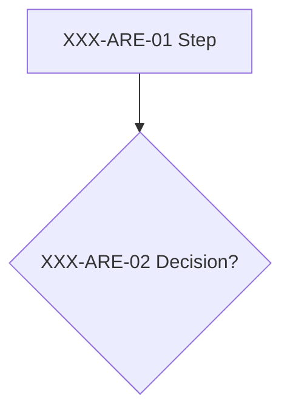
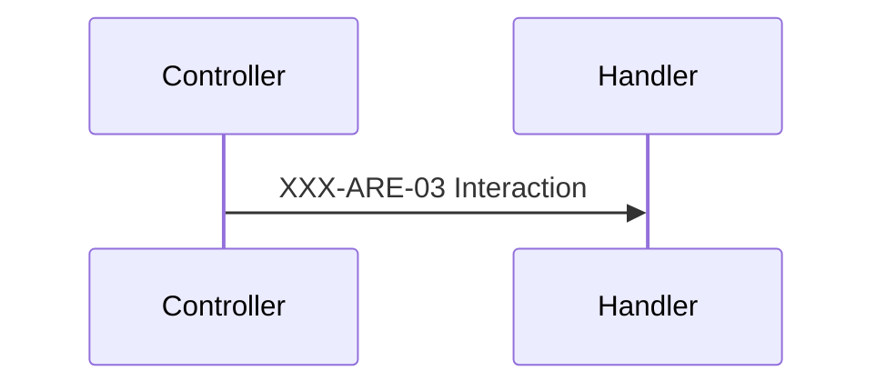

# Documentation Template

Every document in `docs/` follows this structure, so readers find the same things in the same places. `conventions.md` uses it without the Endpoints and Data model sections.

## Keys

- A topic key `API-AREA` (for example `SAL-DSP`) names one process and appears in its section heading: `## SAL-DSP — Dispatch cycle`.
- A step key `API-AREA-NN` (for example `SAL-DSP-04`) names one point of that process: a call, a branch, a write, or a response our code builds. It appears in diagram labels.
- When the point runs inside a framework (JWT bearer authentication, the Rebus pipeline), the step key names the hook where its trace goes: a JWT bearer event, a Rebus pipeline step, or a Rebus error handler.
- Several topics may key the same shared line, such as the transaction commit; a trace picks the key by the command type.
- Topics that describe no process of their own (an overview, a catalog, an operations guide) have no step keys; their diagrams cite other topics by topic key.
- The same point uses the same step key in the topic's flowchart and in its sequence diagram.
- Keys never change. A new step takes the next free number of its area, even between existing steps, and a removed step's number is never reused.
- Each area belongs to one document, and [INDEX.md](INDEX.md) registers every topic.
- The trace console prints these keys: from the repository root, `dotnet run --project tools/Ambev.DeveloperEvaluation.DevConsole -- t <scenario>` hosts the API in process and prints one line per step, `HH:mm:ss.ffffff  T022  SAL-CRT-04 CMN-PIP-10  Validate the command  presetId=null valid=True errors=0  CreateSaleHandler.cs:74` (a shared line prints every key it carries). It wipes the development databases first; see [README.md](../README.md#9-trace-console). Every step key has a `StepTrace.Step` call at its source line, and the unit test `StepKeyCoverageTests` fails when a documented key has no call or a call uses an undocumented key. Tools extract keys with `\b[A-Z]{3}-[A-Z]{3}(-\d{2})?\b`.

## Diagrams

- Every process topic has at least one Mermaid diagram: a flowchart for decisions and a sequence diagram for interactions between components.
- A flowchart node id is the area followed by the number: `DSP04["SAL-DSP-04 Send with the row id"]`. Decisions use `{"..."}`, and states use `state "SAL-BUS-01 Queued" as BUS01`.
- Error outcomes (400, 401, 404, 409) are nodes without a key; the decision that leads to them carries it.
- A diagram refers to another topic by its topic key only (`BUS["see SAL-BUS"]`), never by one of that topic's step keys.
- A dotted edge (`-.->`) marks an asynchronous hand-off.
- Allowed kinds: `flowchart`, `sequenceDiagram`, `erDiagram`, `classDiagram`, `stateDiagram-v2`. Every label goes in double quotes and contains no double quotes, semicolons, or angle brackets.

## Writing

- At most three lines of context per topic: what the process does and why.
- `**Source:**` lists the repository-relative files the topic describes.
- Rules are bullets that start with the step key they explain and add only what the diagram cannot show.
- Swagger owns the full request and response schemas; list only fields that carry a rule.

## Skeleton

````markdown
# <Name> API

<One line: what the API is for.>

> Work item: TD-0NN · Key: XXX · Routes: `/api/<resource>`

## Endpoints

| Topic | Method | Route | Roles | Success | Errors |
|---|---|---|---|---|---|

## Data model

Only fields that carry a rule, plus constraints (unique indexes, sequences, defaults).
An `erDiagram` when more than one table is involved.

## XXX-ARE — <Process name>

<At most three lines: what the process does and why.>

**Source:** `src/<repository-relative path>`





- XXX-ARE-02: <rule the diagram does not show>

## Known limitations

- <one line each; cite a backlog item when one exists>

## See also

- <links>
````
