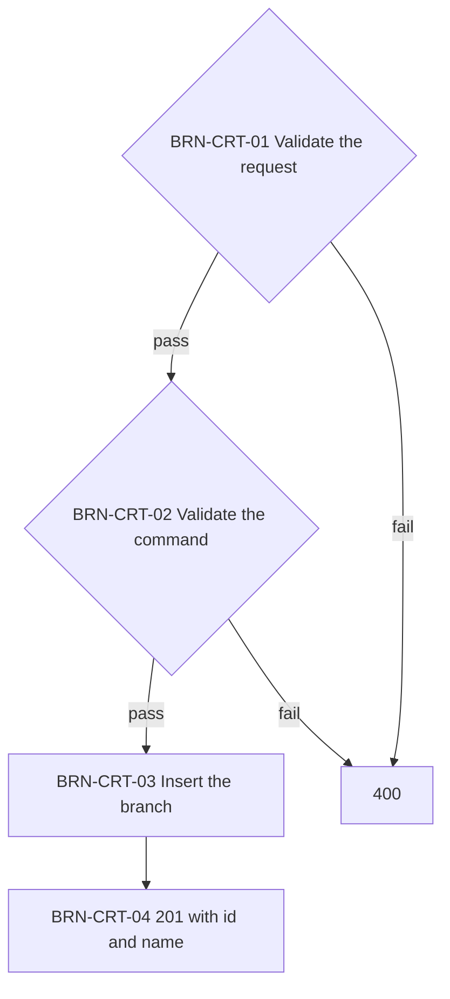
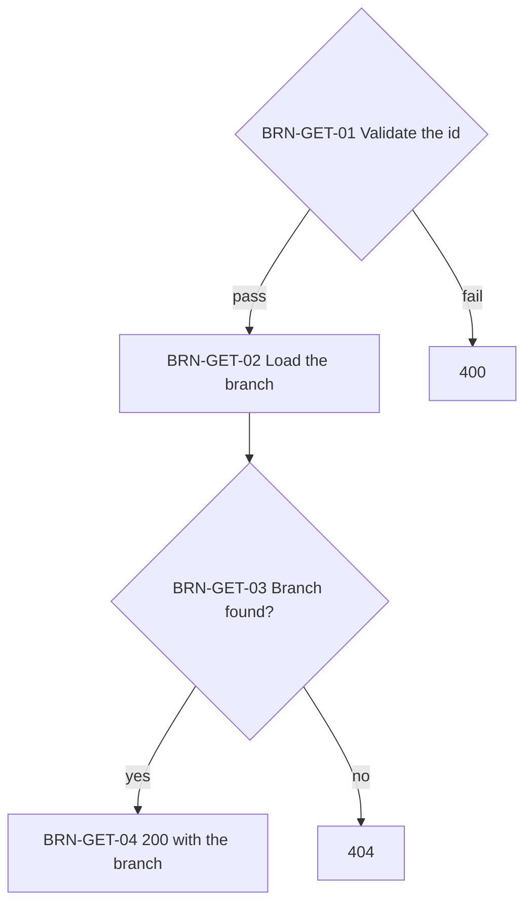
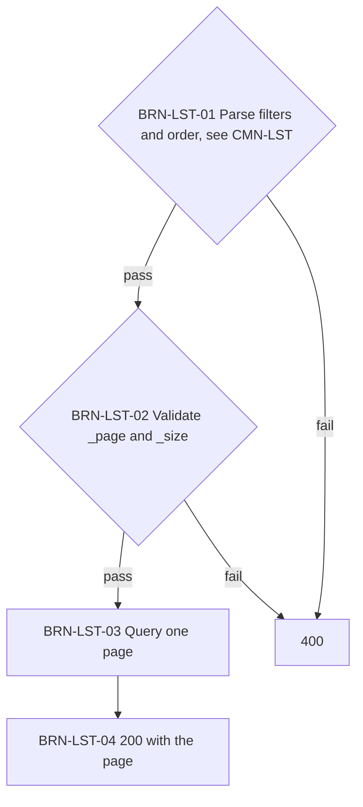
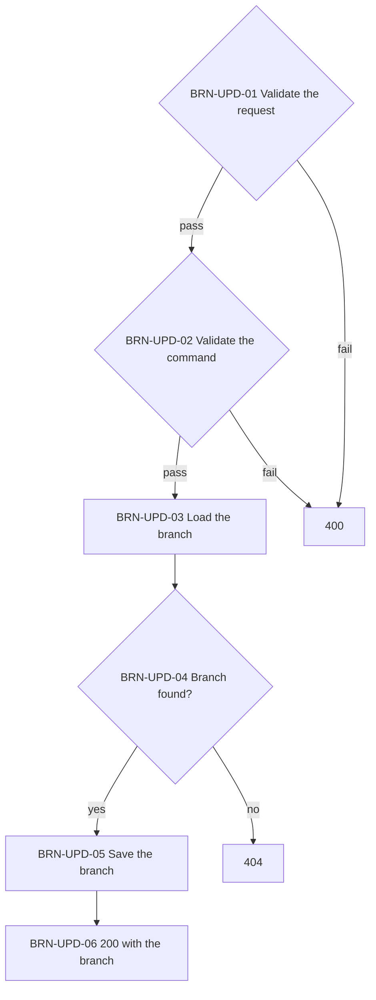
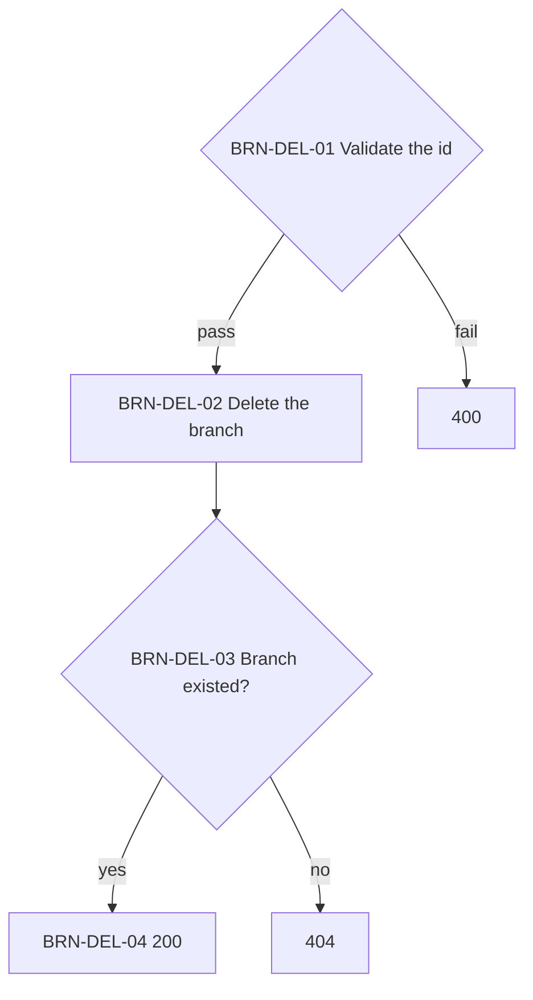

# Branches API

The branch registry. Sales reference branches by id and copy their name.

> Work item: TD-027 · Key: BRN · Routes: `/api/branches`

## Endpoints

| Topic | Method | Route | Roles | Success | Errors |
|---|---|---|---|---|---|
| BRN-CRT | POST | `/api/branches` | Admin, Manager | 201 | 400, 401, 403 |
| BRN-GET | GET | `/api/branches/{id}` | any authenticated | 200 | 400, 401, 404 |
| BRN-LST | GET | `/api/branches` | any authenticated | 200 | 400, 401 |
| BRN-UPD | PUT | `/api/branches/{id}` | Admin, Manager | 200 | 400, 401, 403, 404 |
| BRN-DEL | DELETE | `/api/branches/{id}` | Admin, Manager | 200 | 400, 401, 403, 404 |

## Data model

- `Name`: required, at most 100 characters, not unique.

## BRN-CRT — Create a branch

Stores a new branch. Names are not unique, so the same request twice creates two branches.

**Source:** `src/Ambev.DeveloperEvaluation.WebApi/Features/Branches/BranchesController.cs`, `src/Ambev.DeveloperEvaluation.Application/Branches/CreateBranch/CreateBranchHandler.cs`

## BRN-GET — Get a branch

Returns one branch by id.

**Source:** `src/Ambev.DeveloperEvaluation.WebApi/Features/Branches/BranchesController.cs`, `src/Ambev.DeveloperEvaluation.Application/Branches/GetBranch/GetBranchHandler.cs`

## BRN-LST — List branches

Returns branches one page at a time with the list conventions of CMN-LST.

**Source:** `src/Ambev.DeveloperEvaluation.WebApi/Features/Branches/BranchesController.cs`, `src/Ambev.DeveloperEvaluation.Application/Branches/ListBranches/ListBranchesHandler.cs`, `src/Ambev.DeveloperEvaluation.ORM/Repositories/BranchRepository.cs`

- BRN-LST-01: the fields are `id` and `name`.
- BRN-LST-03: the default order is name, then id.

## BRN-UPD — Update a branch

Renames a branch. Sales keep the name they copied when they were written.

**Source:** `src/Ambev.DeveloperEvaluation.WebApi/Features/Branches/BranchesController.cs`, `src/Ambev.DeveloperEvaluation.Application/Branches/UpdateBranch/UpdateBranchHandler.cs`

## BRN-DEL — Delete a branch

Deletes one branch by id. Sales that reference it are untouched.

**Source:** `src/Ambev.DeveloperEvaluation.WebApi/Features/Branches/BranchesController.cs`, `src/Ambev.DeveloperEvaluation.Application/Branches/DeleteBranch/DeleteBranchHandler.cs`

- BRN-DEL-02: no foreign key points to branches, so sales never block the delete and keep the copied name.

## Known limitations

- Branch names are not unique.
- Deleting a branch leaves sales pointing to an id that no longer exists.

## See also

- [conventions.md](conventions.md#cmn-lst--list-queries): filters, order, and pages
- [conventions.md](conventions.md#cmn-pip--request-pipeline): the path every request follows
- [INDEX.md](INDEX.md)
