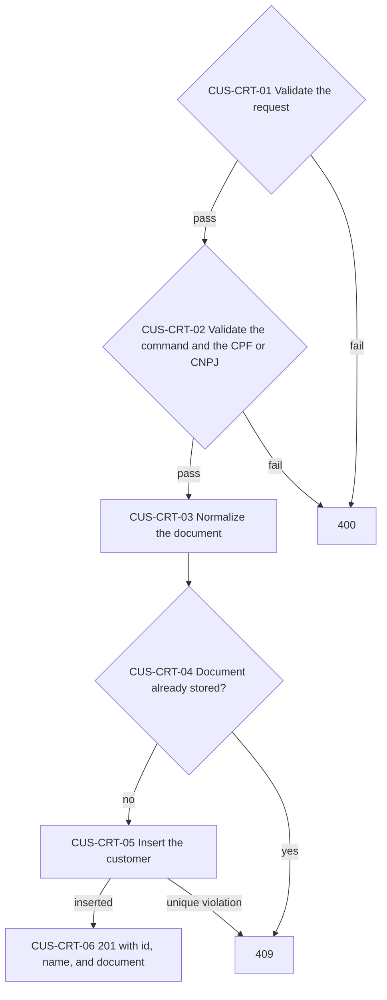
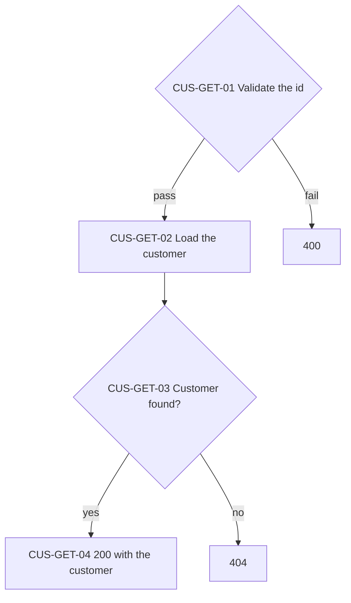
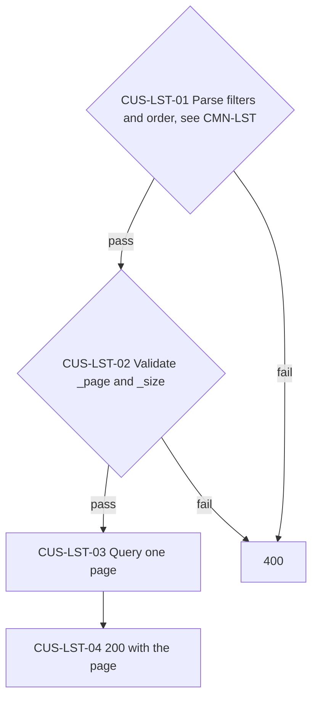
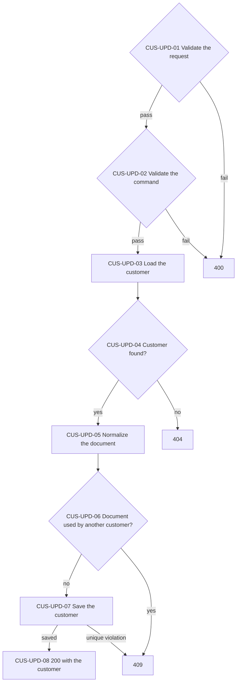
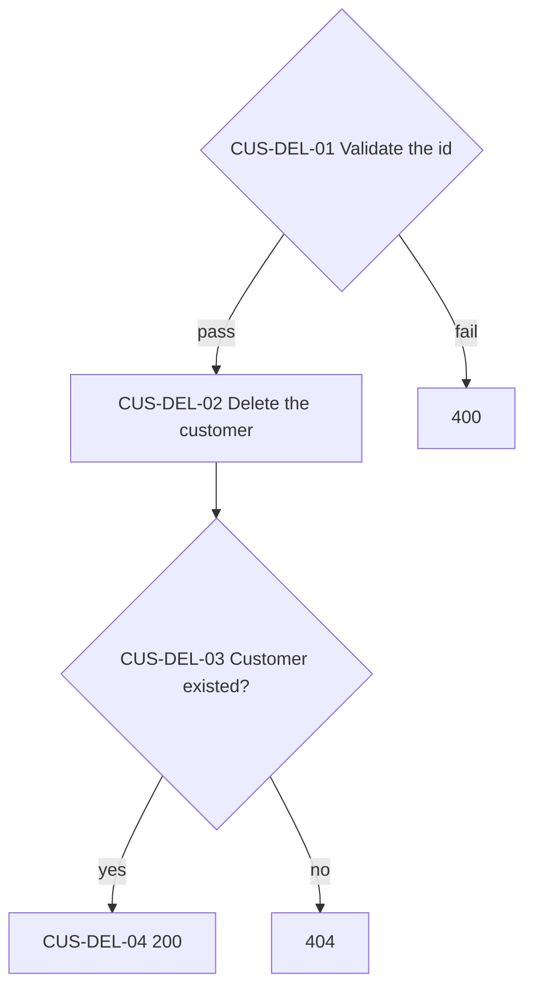

# Customers API

The customer registry. Sales reference customers by id and copy their name.

> Work item: TD-026 · Key: CUS · Routes: `/api/customers`

## Endpoints

| Topic | Method | Route | Roles | Success | Errors |
|---|---|---|---|---|---|
| CUS-CRT | POST | `/api/customers` | Admin, Manager | 201 | 400, 401, 403, 409 |
| CUS-GET | GET | `/api/customers/{id}` | any authenticated | 200 | 400, 401, 404 |
| CUS-LST | GET | `/api/customers` | any authenticated | 200 | 400, 401 |
| CUS-UPD | PUT | `/api/customers/{id}` | Admin, Manager | 200 | 400, 401, 403, 404, 409 |
| CUS-DEL | DELETE | `/api/customers/{id}` | Admin, Manager | 200 | 400, 401, 403, 404 |

## Data model

- `Name`: required, at most 100 characters.
- `Document`: stored normalized (dots, dashes, slashes, and spaces removed, uppercase); a CPF (11 characters) or a CNPJ (14) with valid check digits; unique index.

## CUS-CRT — Create a customer

Stores a new customer. The document is normalized first, so a formatted and an unformatted CPF are the same customer.

**Source:** `src/Ambev.DeveloperEvaluation.WebApi/Features/Customers/CustomersController.cs`, `src/Ambev.DeveloperEvaluation.Application/Customers/CreateCustomer/CreateCustomerHandler.cs`, `src/Ambev.DeveloperEvaluation.Domain/Validation/DocumentNumber.cs`, `src/Ambev.DeveloperEvaluation.ORM/Repositories/CustomerRepository.cs`

- CUS-CRT-05: two concurrent requests with one document both pass CUS-CRT-04; the unique index turns the second into a 409.
- CUS-CRT-06: the response carries the normalized document.

## CUS-GET — Get a customer

Returns one customer by id.

**Source:** `src/Ambev.DeveloperEvaluation.WebApi/Features/Customers/CustomersController.cs`, `src/Ambev.DeveloperEvaluation.Application/Customers/GetCustomer/GetCustomerHandler.cs`

## CUS-LST — List customers

Returns customers one page at a time with the list conventions of CMN-LST.

**Source:** `src/Ambev.DeveloperEvaluation.WebApi/Features/Customers/CustomersController.cs`, `src/Ambev.DeveloperEvaluation.Application/Customers/ListCustomers/ListCustomersHandler.cs`, `src/Ambev.DeveloperEvaluation.ORM/Repositories/CustomerRepository.cs`

- CUS-LST-01: the fields are `id`, `name`, and `document`.
- CUS-LST-03: the default order is name, then id.

## CUS-UPD — Update a customer

Replaces a customer's name and document. Sales keep the name they copied when they were written.

**Source:** `src/Ambev.DeveloperEvaluation.WebApi/Features/Customers/CustomersController.cs`, `src/Ambev.DeveloperEvaluation.Application/Customers/UpdateCustomer/UpdateCustomerHandler.cs`, `src/Ambev.DeveloperEvaluation.ORM/Repositories/CustomerRepository.cs`

- CUS-UPD-07: sales written earlier keep the old name; there is no foreign key to update them (SAL-CRT copies the name).

## CUS-DEL — Delete a customer

Deletes one customer by id. Sales that reference it are untouched.

**Source:** `src/Ambev.DeveloperEvaluation.WebApi/Features/Customers/CustomersController.cs`, `src/Ambev.DeveloperEvaluation.Application/Customers/DeleteCustomer/DeleteCustomerHandler.cs`

- CUS-DEL-02: no foreign key points to customers, so sales never block the delete and keep the copied name.

## Known limitations

- Deleting a customer leaves sales pointing to an id that no longer exists.

## See also

- [conventions.md](conventions.md#cmn-lst--list-queries): filters, order, and pages
- [conventions.md](conventions.md#cmn-pip--request-pipeline): the path every request follows
- [INDEX.md](INDEX.md)
