# Sales API

Records sales with their items, synchronously or through a queue, and publishes an event for every change through a transactional outbox.

> Work item: TD-029, TASK-076 (FEAT-003), TASK-078 (FEAT-003) · Key: SAL · Routes: `/api/sales`

## Endpoints

| Topic | Method | Route | Roles | Success | Errors |
|---|---|---|---|---|---|
| SAL-CRT | POST | `/api/sales` | Admin, Manager | 201 | 400, 401, 403 |
| SAL-ASY | POST with `Prefer: respond-async` | `/api/sales` | Admin, Manager | 202 | 400, 401, 403 |
| SAL-GET | GET | `/api/sales/{id}` | any authenticated | 200 | 400, 401, 404 |
| SAL-LST | GET | `/api/sales` | any authenticated | 200 | 400, 401 |
| SAL-UPD | PUT | `/api/sales/{id}` | Admin, Manager | 200 | 400, 401, 403, 404 |
| SAL-DEL | DELETE | `/api/sales/{id}` | Admin, Manager | 200 | 400, 401, 403, 404 |

## Data model

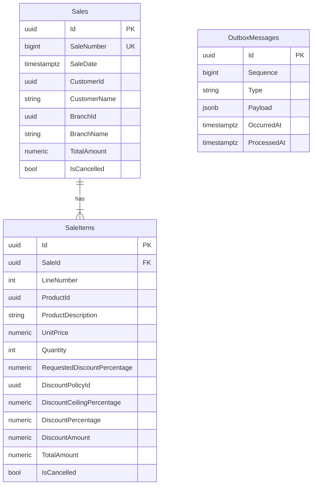

- `SaleNumber` comes from the `SaleNumbers` sequence and is unique; `Id` defaults to `gen_random_uuid()` unless the command presets it (SAL-ASY).
- Money columns are `numeric(18,2)` and the three percentages are `numeric(5,2)`; the validators reject more than two decimals.
- Check constraints guard the stored values: positive line number, unit price, and quantity; every percentage from 0 to 100, the requested one also null; no negative amount.
- `CustomerName`, `BranchName`, `ProductDescription`, and `UnitPrice` are copies taken when the sale or the item is written; no foreign key points to customers, branches, or products.
- `RequestedDiscountPercentage` is what the client asked for (null for the ceiling); `DiscountPolicyId` and `DiscountCeilingPercentage` snapshot the discount policy that priced the item, without a foreign key (see discount-policies.md); `DiscountAmount`, `TotalAmount`, and `Sales.TotalAmount` are computed (SAL-CRT-16). Items stored before the discount policies point to the default policy, with their stored percentage as the ceiling.
- `LineNumber` orders the items, and deleting a sale deletes its items.
- `OutboxMessages.ProcessedAt` is null while a row is pending; the partial index `IX_OutboxMessages_Pending` on `Sequence` covers only pending rows.

**Read model.** MongoDB `ReadModel:Database`, collection `ReadModel:Collection` (`developer_evaluation_read.sales` in `appsettings.json`): one document per sale with the fields of the sale response (`Id` as `_id`, `SaleNumber`, `SaleDate`, customer and branch, `TotalAmount`, `IsCancelled`, `Items` with the discount snapshot fields), plus `Version` (the outbox `Sequence` of the last event applied) and `IsDeleted` (a tombstone). Guids use the standard binary subtype, decimals are Decimal128. No indexes: `SaleNumber` uniqueness is PostgreSQL's.

## SAL-OVW — Overview

The API writes sales and their events to PostgreSQL in one transaction. A relay moves the events to a MongoDB queue that also carries queued sales, and workers in the same API consume both: one logs the events, the other projects them into a MongoDB collection that the get and list endpoints read.

**Source:** `src/Ambev.DeveloperEvaluation.WebApi/Features/Sales/SalesController.cs`, `src/Ambev.DeveloperEvaluation.WebApi/Messaging/MessagingExtensions.cs`

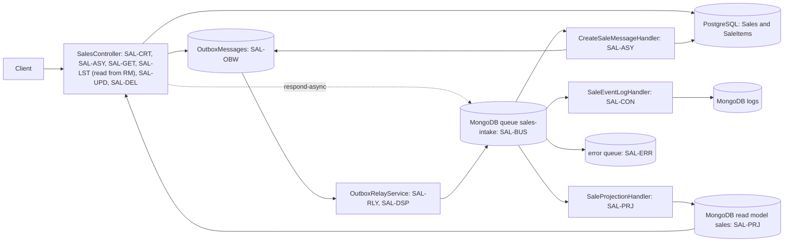

## SAL-CRT — Create a sale

`POST /api/sales` without `Prefer: respond-async` prices the items from the discount policies, stores the sale in the request's transaction, and records SaleCreated in the outbox. The same handler also runs queued sales (SAL-ASY).

**Source:** `src/Ambev.DeveloperEvaluation.WebApi/Features/Sales/SalesController.cs`, `src/Ambev.DeveloperEvaluation.WebApi/Common/PreferHeader.cs`, `src/Ambev.DeveloperEvaluation.Application/Sales/CreateSale/CreateSaleHandler.cs`, `src/Ambev.DeveloperEvaluation.Domain/Services/SaleDiscountRules.cs`, `src/Ambev.DeveloperEvaluation.Domain/Services/DiscountPolicyResolver.cs`, `src/Ambev.DeveloperEvaluation.Domain/Entities/Sale.cs`, `src/Ambev.DeveloperEvaluation.ORM/Repositories/SaleRepository.cs`

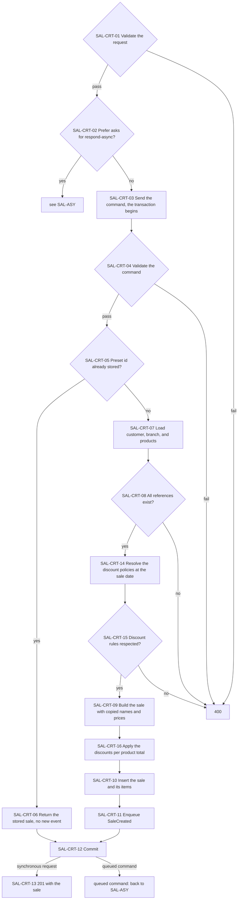

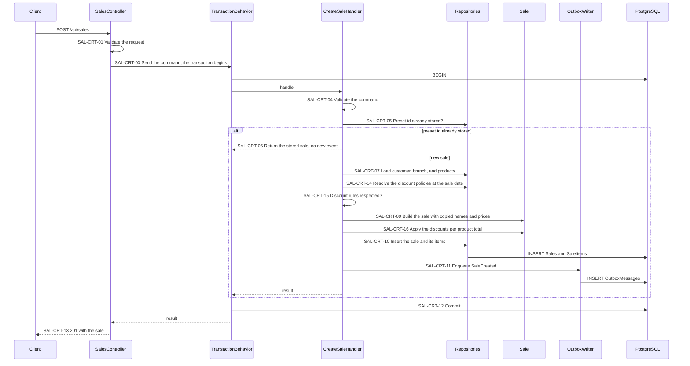

- SAL-CRT-01: customer and branch ids are required, and there is at least one item; the quantity is above zero; the discount percentage, when sent, is from 0 to 100 with at most two decimals. The body carries no amounts: `discountAmount` and `totalAmount` are computed.
- SAL-CRT-01: `discountAmount` and `totalAmount` sent by older clients are ignored; an explicit `discountPercentage: 0` asks for 0% and gets no discount even at 4 units or more; omit the field to receive the ceiling.
- SAL-CRT-05: only a queued command carries a preset id; a synchronous request never does (TD-012).
- SAL-CRT-09: the sale date is the server's UTC time truncated to microseconds; line numbers follow the request order; each item keeps the requested discount percentage, or null when none was sent.
- SAL-CRT-14: one query loads every policy in effect at the sale date (a policy disabled at or before that date is ignored) whose product is one of the sale's products or null and whose branch is the sale's branch or null; per product the most specific scope wins (product and branch, product, branch, default), then the latest `validFrom`, then the latest `createdAt`, then the highest id.
- SAL-CRT-15: the quantities of a product's lines are summed. Above the policy maximum every line of the product fails with `QuantityLimitExceeded`; otherwise a line whose requested discount is above the ceiling of the total's tier fails with `DiscountAboveAllowed` (below the first tier the ceiling is 0, so a discount on fewer than 4 units fails with the default policy); a line whose product has no policy fails with `NoDiscountPolicy`. Each failure is one 400 entry with `error` set to the code.
- SAL-CRT-16: every line of a product gets the ceiling of the product's total, or its requested discount when lower; the discount amount is quantity times unit price times the percentage, rounded to cents with midpoints away from zero; the item total is the gross minus the discount, and the sale total the sum of the item totals. Each item stores the policy id and the ceiling; the responses return each item's `requestedDiscountPercentage`, `discountPolicyId`, and `discountCeilingPercentage`.
- SAL-CRT-10: the sale number comes from the `SaleNumbers` sequence.
- SAL-CRT-12: the sale and its SaleCreated row become visible together, or neither does (CMN-TXN).

## SAL-ASY — Queue a sale

With `Prefer: respond-async` the API validates the body, queues the command, and answers 202 at once. A Rebus worker in the same process stores the sale later through the SAL-CRT handler.

**Source:** `src/Ambev.DeveloperEvaluation.WebApi/Features/Sales/SalesController.cs`, `src/Ambev.DeveloperEvaluation.WebApi/Messaging/CreateSaleMessageHandler.cs`, `src/Ambev.DeveloperEvaluation.WebApi/Messaging/MessagingExtensions.cs`

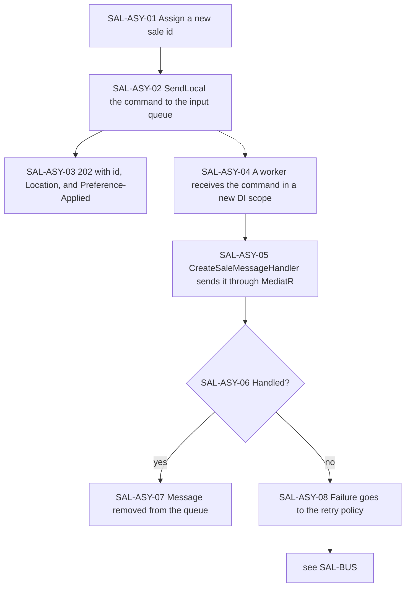

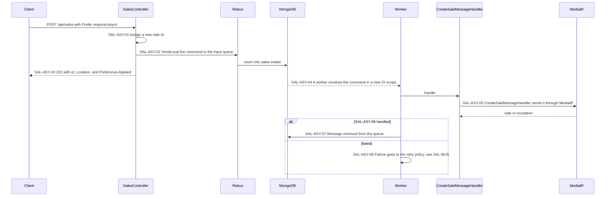

- SAL-ASY-02: only SAL-CRT-01 runs before queueing; an unknown customer, branch, or product, or a sale that breaks a discount rule (SAL-CRT-15), is found by the worker and ends in the error queue (SAL-ERR).
- SAL-ASY-03: `Prefer` is a comma-separated list; `respond-async` is matched case-insensitively and parameters after `;` are ignored. `GET /api/sales/{id}` answers 404 until the worker stores the sale; a sale the worker rejects is never stored and answers 404 for good, so the client cannot tell it from one still queued.
- SAL-ASY-05: the command then runs SAL-CRT-04 to SAL-CRT-12, discounts included (SAL-CRT-14 to SAL-CRT-16); it enters MediatR here, not at SAL-CRT-03, and gets no 201, so the stored sale also gets SaleCreated; a redelivered command ends at SAL-CRT-06.

## SAL-GET — Get a sale

Returns one sale with its items in line order.

**Source:** `src/Ambev.DeveloperEvaluation.WebApi/Features/Sales/SalesController.cs`, `src/Ambev.DeveloperEvaluation.Application/Sales/GetSale/GetSaleHandler.cs`, `src/Ambev.DeveloperEvaluation.ORM/ReadModel/SaleReadStore.cs`

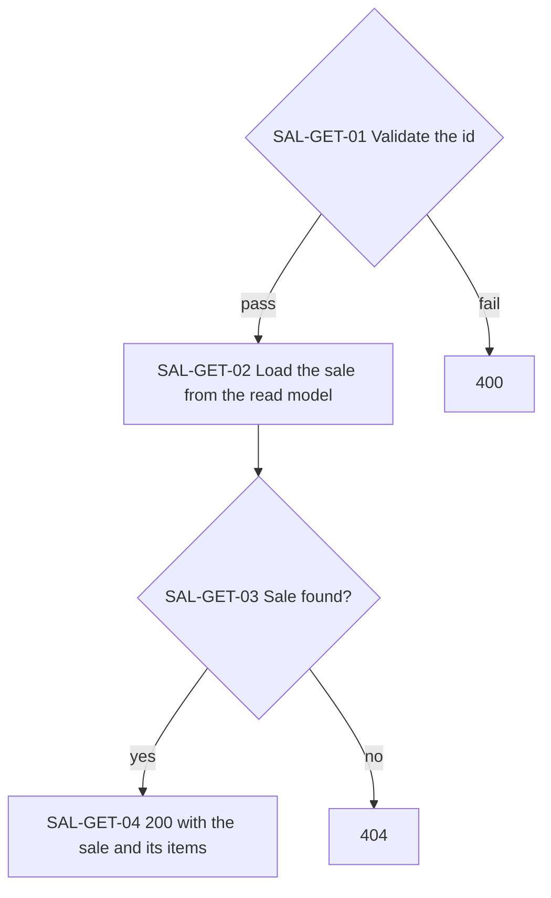

- SAL-GET-03: a sale answers 404 until its SaleCreated is projected (SAL-PRJ), normally within `Outbox:PollingInterval`; a queued sale also until the worker stores it, and for good if the worker rejects it (SAL-ASY); a deleted sale answers 404 from its tombstone.

## SAL-LST — List sales

Returns sale headers one page at a time, without items, with the list conventions of CMN-LST.

**Source:** `src/Ambev.DeveloperEvaluation.WebApi/Features/Sales/SalesController.cs`, `src/Ambev.DeveloperEvaluation.Application/Sales/ListSales/ListSalesHandler.cs`, `src/Ambev.DeveloperEvaluation.ORM/ReadModel/SaleReadStore.cs`

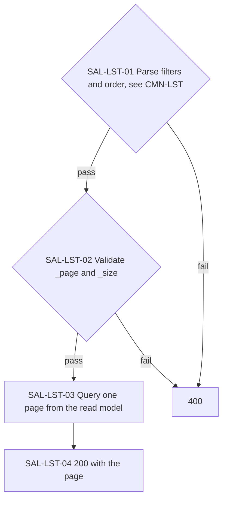

- SAL-LST-01: the fields are `id`, `saleNumber`, `saleDate`, `customerId`, `customerName`, `branchId`, `branchName`, `totalAmount`, and `isCancelled`; `saleNumber`, `saleDate`, and `totalAmount` also accept `_min` and `_max`.
- SAL-LST-03: the default order is sale number, then id; the read store runs CMN-LST-09 on the MongoDB collection, where the `*` filter is a case-insensitive regular expression; use SAL-GET for the items.

## SAL-UPD — Update a sale

Replaces the sale's header values and item list in one transaction and prices the items again at the stored sale date. Items are matched by id, and events describe the transitions the update caused.

**Source:** `src/Ambev.DeveloperEvaluation.WebApi/Features/Sales/SalesController.cs`, `src/Ambev.DeveloperEvaluation.Application/Sales/UpdateSale/UpdateSaleHandler.cs`, `src/Ambev.DeveloperEvaluation.Domain/Services/SaleDiscountRules.cs`, `src/Ambev.DeveloperEvaluation.Domain/Services/DiscountPolicyResolver.cs`, `src/Ambev.DeveloperEvaluation.Domain/Entities/Sale.cs`, `src/Ambev.DeveloperEvaluation.ORM/Repositories/SaleRepository.cs`

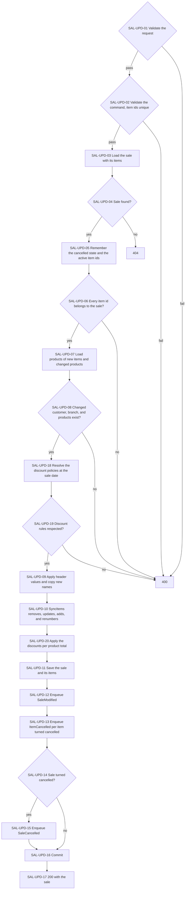

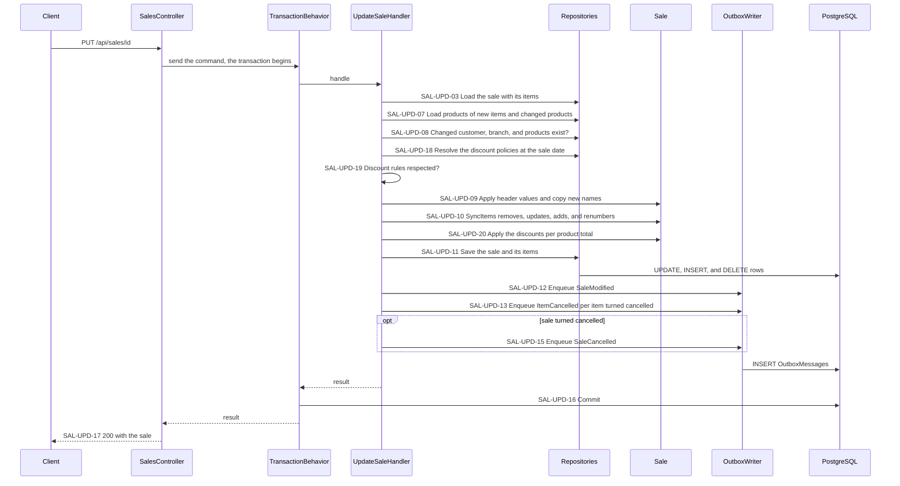

- SAL-UPD-06: an item without an id is new; an id from another sale is rejected, not moved.
- SAL-UPD-07: a kept item keeps its copied description and unit price, even if the catalog changed since.
- SAL-UPD-18: the policies are the ones in effect at the stored sale date, never the current date, for the branch the request sends; a policy created after the sale never reprices it, and a policy disabled after the sale date (DSC-DIS) still applies to it, so disabling a policy never locks an older sale.
- SAL-UPD-19: the checks of SAL-CRT-15 over the request's items; a cancelled item counts toward no product total and its requested discount is not checked. Each request states every active item's requested discount again, which the responses return as `requestedDiscountPercentage`: an active item sent without one receives the ceiling.
- SAL-UPD-09: the sale number and date never change; `IsCancelled` is stored as received; the totals come from SAL-UPD-20.
- SAL-UPD-10: items missing from the request are deleted and emit no event; line numbers follow the request order; an active kept item takes the request's quantity, requested discount, and cancelled flag, and keeps its discount values until SAL-UPD-20.
- SAL-UPD-10: a kept item sent as cancelled keeps the values it was priced with (product, description, unit price, quantity, requested discount, and discount snapshot) and only its flag is applied, so SAL-UPD-07 does not load its product and SAL-UPD-19 and SAL-UPD-13 use its stored product.
- SAL-UPD-20: active items are priced as in SAL-CRT-16, so cancelling a line can lower the tier of the other lines of its product; a cancelled item keeps the values it was last priced with, an item sent already cancelled is stored with its policy and no discount, and cancelled items are left out of the sale total.
- SAL-UPD-13: an item that was already cancelled emits nothing again, a new item sent already cancelled emits nothing, and cancelling the whole sale emits SaleCancelled without an ItemCancelled for each item; un-cancelling a sale or an item is accepted and emits only SaleModified.

## SAL-DEL — Delete a sale

Deletes the sale and its items and records SaleDeleted in the same transaction.

**Source:** `src/Ambev.DeveloperEvaluation.WebApi/Features/Sales/SalesController.cs`, `src/Ambev.DeveloperEvaluation.Application/Sales/DeleteSale/DeleteSaleHandler.cs`, `src/Ambev.DeveloperEvaluation.ORM/Repositories/SaleRepository.cs`

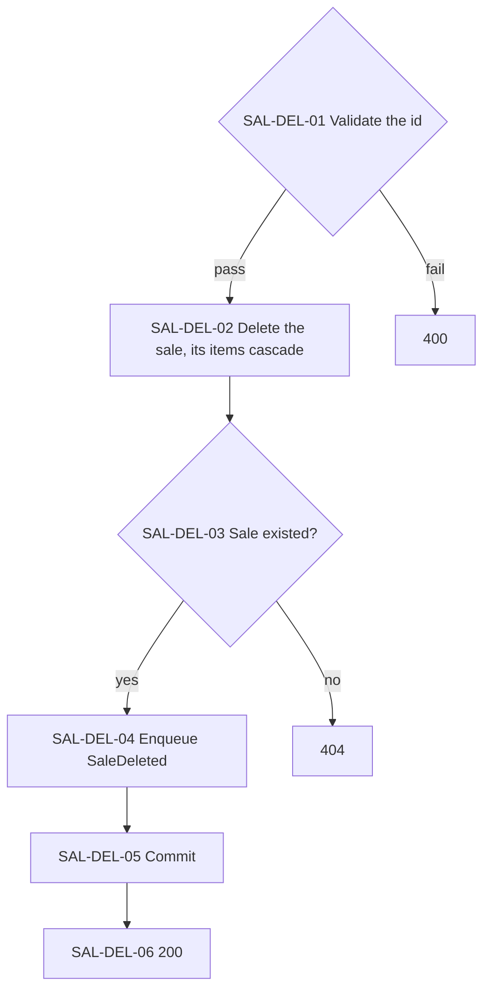

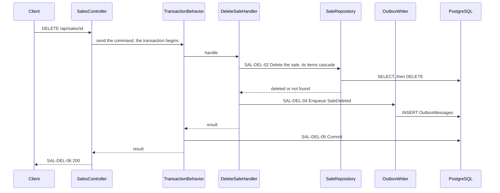

- SAL-DEL-04: SaleDeleted carries only the sale id; an unknown id emits nothing.

## SAL-EVT — Sale events

Five integration events describe sale writes. They are recorded in the outbox (SAL-OBW), dispatched by the relay (SAL-DSP), and logged by the consumer (SAL-CON).

**Source:** `src/Ambev.DeveloperEvaluation.Domain/Events/Sales/SaleSnapshot.cs`, `src/Ambev.DeveloperEvaluation.Domain/Events/IntegrationEventTypes.cs`

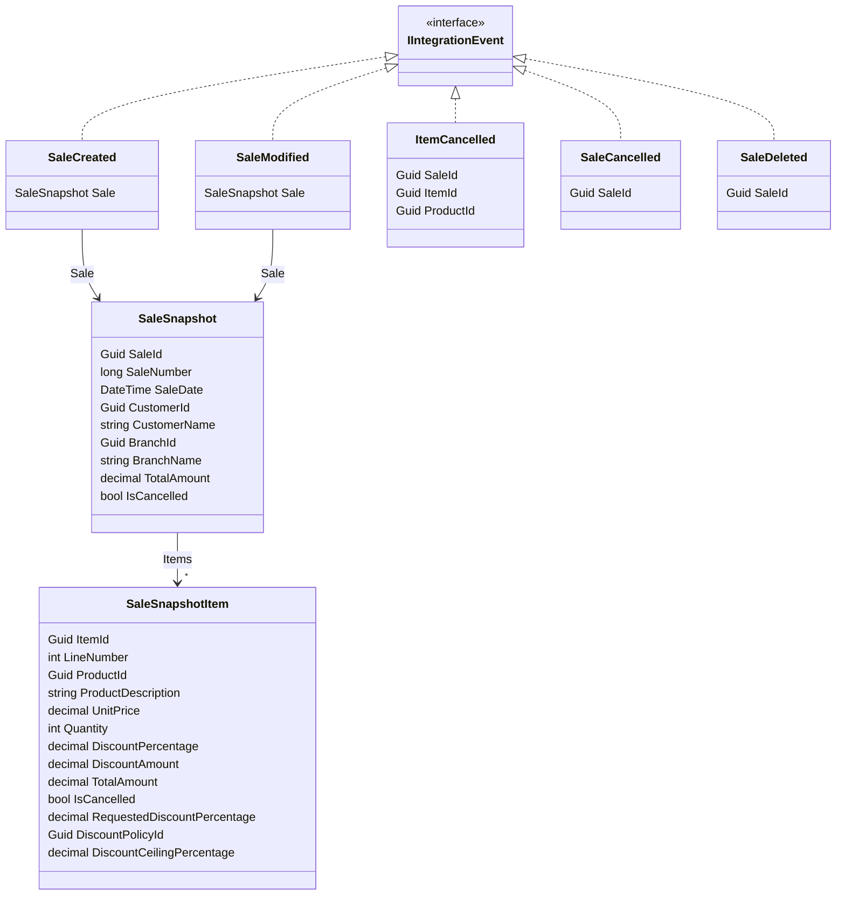

| Event | Emitted by | Payload |
|---|---|---|
| SaleCreated | SAL-CRT-11 | `Sale`: the snapshot after the insert |
| SaleModified | SAL-UPD-12 | `Sale`: the snapshot after the update |
| ItemCancelled | SAL-UPD-13 | `SaleId`, `ItemId`, `ProductId` |
| SaleCancelled | SAL-UPD-15 | `SaleId` |
| SaleDeleted | SAL-DEL-04 | `SaleId` |

- The type name stored with each event is the record's name; `IntegrationEventTypes` accepts only these five (SAL-OBW-03, SAL-DSP-02).
- The snapshot carries every header field and every item, cancelled ones included, in line order.
- Each snapshot item carries the discount snapshot (SAL-CRT-16); `RequestedDiscountPercentage` is null when none was requested, and a payload written before the discount policies reads back with null, an empty policy id, and a zero ceiling.
- Two snapshots with equal values do not compare equal (TD-017).

## SAL-OBW — Outbox write

Recording an event is a row insert in the command's own transaction, so the event exists exactly when the sale write commits.

**Source:** `src/Ambev.DeveloperEvaluation.ORM/Outbox/OutboxWriter.cs`, `src/Ambev.DeveloperEvaluation.Domain/Events/IntegrationEventTypes.cs`, `src/Ambev.DeveloperEvaluation.ORM/Mapping/OutboxMessageConfiguration.cs`

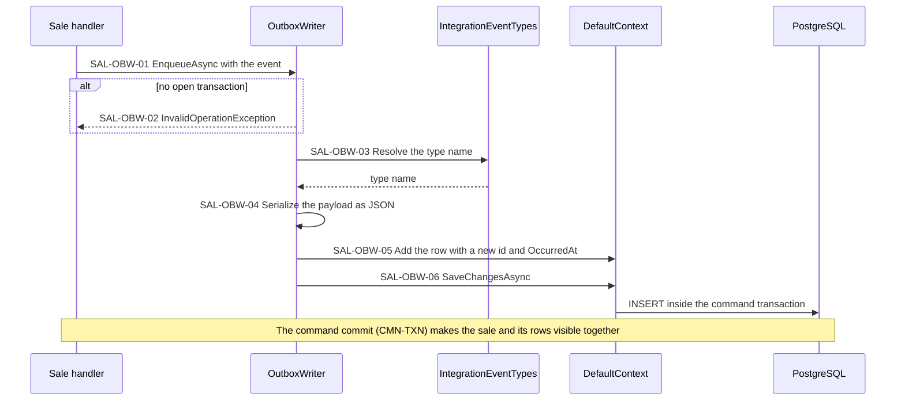

- SAL-OBW-02: the check stops a future write outside `ITransactionalCommand` from losing atomicity silently.
- SAL-OBW-03: an event type must be added to `IntegrationEventTypes` before it can be recorded.
- SAL-OBW-05: `Sequence` comes from the identity column at insert, and a null `ProcessedAt` marks the row pending.
- SAL-OBW-06: the insert joins the command transaction, so a rollback discards the rows with the sale and no event exists for a write that did not happen.

## SAL-RLY — Relay loop

A background service in the API runs dispatch cycles for as long as the API runs: back to back while batches are full, every `Outbox:PollingInterval` otherwise.

**Source:** `src/Ambev.DeveloperEvaluation.WebApi/Messaging/OutboxRelayService.cs`, `src/Ambev.DeveloperEvaluation.WebApi/Messaging/MessagingExtensions.cs`, `src/Ambev.DeveloperEvaluation.WebApi/Messaging/MessagingSettings.cs`

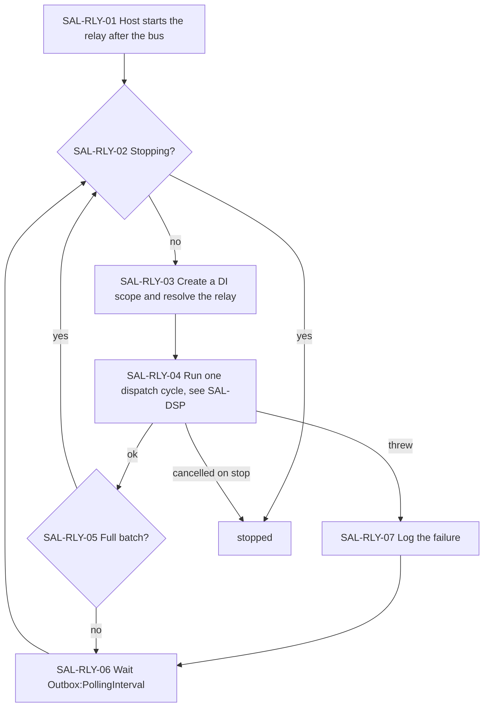

- SAL-RLY-01: the first cycle runs inside host start until its first await, so Kestrel starts listening after it; under a slow debugger this delays the port.
- SAL-RLY-02: a stop during the wait or the cycle ends the loop without logging a failure; a stop in the middle of a cycle can send one event twice (TD-016).
- SAL-RLY-05: a backlog drains without waiting between full batches of `Outbox:BatchSize` rows.

## SAL-DSP — Dispatch cycle

One cycle publishes pending rows in `Sequence` order and marks each one processed. The first failure ends the cycle, so no event overtakes an earlier one.

**Source:** `src/Ambev.DeveloperEvaluation.ORM/Outbox/OutboxRelay.cs`, `src/Ambev.DeveloperEvaluation.WebApi/Messaging/RebusEventPublisher.cs`, `src/Ambev.DeveloperEvaluation.Domain/Events/IntegrationEventTypes.cs`

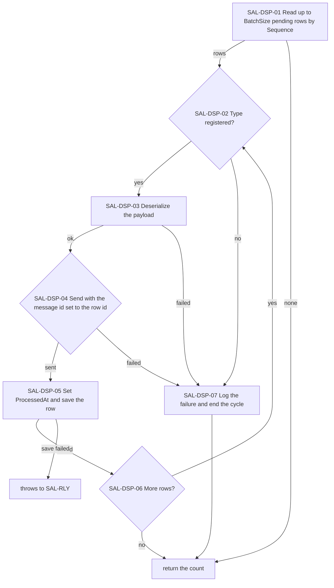

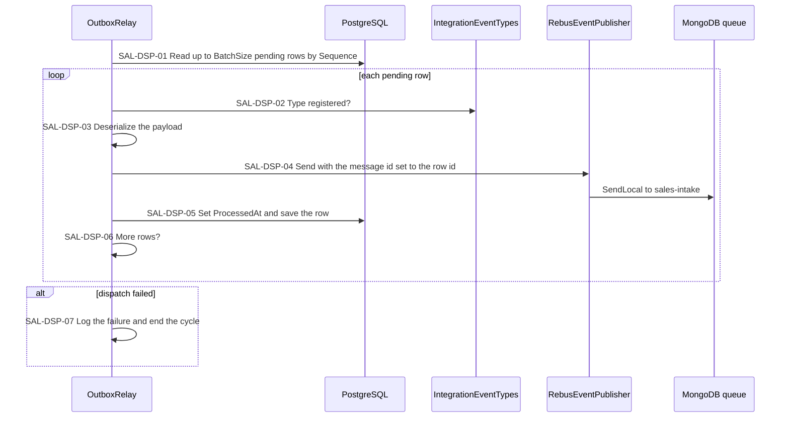

- SAL-DSP-04: the Rebus header `rbs2-msg-id` is the row id, so a re-sent event keeps its id, and the header `outbox-sequence` is the row sequence, which the read model uses to order events of one sale (SAL-PRJ).
- SAL-DSP-05: the save runs outside the failure handling of SAL-DSP-07, so a failed save or a crash after SAL-DSP-04 ends the cycle in SAL-RLY and the already-sent event is sent again on the next cycle (at-least-once).
- SAL-DSP-07: the failed row and every later row wait for the next cycle (SAL-RLY-06); a cancellation stops the cycle without being logged as a failure.

## SAL-BUS — Message bus

Rebus moves messages through a MongoDB collection that works as the queue. Queued sales and sale events share the `sales-intake` queue, which workers inside the API consume.

**Source:** `src/Ambev.DeveloperEvaluation.WebApi/Messaging/MessagingExtensions.cs`, `src/Ambev.DeveloperEvaluation.WebApi/Messaging/MessagingSettings.cs`, `src/Ambev.DeveloperEvaluation.WebApi/appsettings.json`

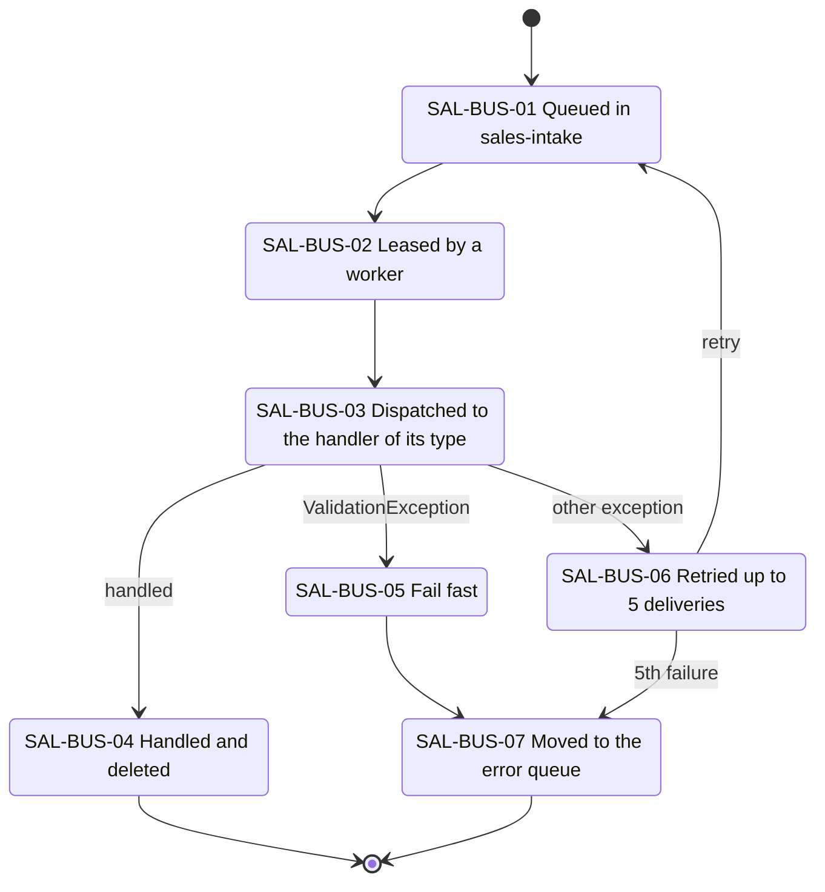

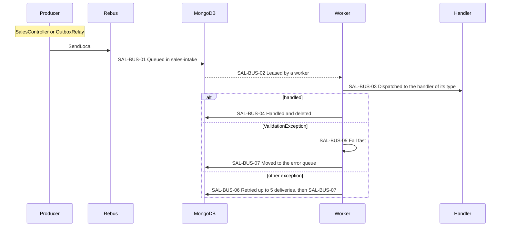

- SAL-BUS-01: the queue lives in the database named by `ConnectionStrings:MessageBus` (`developer_evaluation_bus`); the transport creates its index when the bus starts, so the API does not start without MongoDB; the compose API waits for the MongoDB healthcheck (TD-011).
- SAL-BUS-02: `Rebus:Workers` is 1 and `Rebus:MaxParallelism` is 20, which must stay below the Npgsql pool size.
- SAL-BUS-03: each message gets its own DI scope and so its own `DefaultContext`; `CreateSaleCommand` and the five events share the queue.
- SAL-BUS-06: 5 delivery attempts is the Rebus default, and nothing overrides it.

## SAL-CON — Event consumer

`SaleEventLogHandler` consumes the five events and writes one log line per event. `SaleProjectionHandler` (SAL-PRJ) consumes the same events; a throw in either handler fails the message for both.

**Source:** `src/Ambev.DeveloperEvaluation.WebApi/Messaging/SaleEventLogHandler.cs`

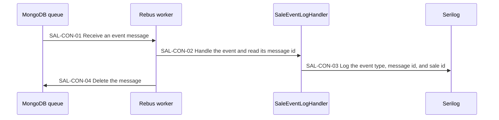

- SAL-CON-01: events may be consumed in any order, because the worker handles messages in parallel.
- SAL-CON-02: the message id is the outbox row id (SAL-DSP-04), so a consumer can drop duplicates; this one does not need to, because logging twice is harmless.
- SAL-CON-03: MongoDB `developer_evaluation_logs.logs` stores the line as `Sale event "SaleCreated" "<message id>" for sale <sale id>`, and the console prints it without the quotes.

## SAL-PRJ — Read model projection

`SaleProjectionHandler` keeps the MongoDB sales collection that SAL-GET and SAL-LST read. Every write is ordered by the outbox sequence the relay sends as a header, so events of one sale handled in parallel, or delivered again, never leave an older state.

**Source:** `src/Ambev.DeveloperEvaluation.WebApi/Messaging/SaleProjectionHandler.cs`, `src/Ambev.DeveloperEvaluation.ORM/ReadModel/SaleReadStore.cs`, `src/Ambev.DeveloperEvaluation.ORM/ReadModel/SaleDocument.cs`

```mermaid
sequenceDiagram
  participant W as Rebus worker
  participant H as SaleProjectionHandler
  participant S as SaleReadStore
  participant M as MongoDB sales collection
  W->>H: event with the outbox-sequence header
  H->>S: upsert the snapshot, or a tombstone for SaleDeleted, if the stored version is older
  S->>M: one write whose filter is the id and Version lower than the sequence
  M-->>S: written, or duplicate key when the stored version is newer
  S-->>H: applied or older
  H->>H: SAL-PRJ-01 Apply the event to the read model
  H->>H: SAL-PRJ-02 Event older than the document, ignored
```

- SAL-PRJ-01: `action` is `upsert` for SaleCreated and SaleModified, `tombstone` for SaleDeleted, and `none` for SaleCancelled and ItemCancelled, whose state the SaleModified written with them already carried (SAL-EVT). A message without the `outbox-sequence` header fails and goes to the error queue (SAL-ERR).
- SAL-PRJ-02: the stored `Version` is greater than or equal to the sequence: a delayed or re-delivered event. A tombstone keeps its version, so a SaleModified that arrives after the SaleDeleted of the same sale is ignored too. A duplicate key on the upsert is retried once without upsert, because it also happens when two handlers insert the first document of a sale at the same time; the newer event then matches and wins.
- Reads are eventual: a sale appears in SAL-GET and SAL-LST once its SaleCreated is projected, normally within `Outbox:PollingInterval`. MongoDB unreachable while projecting fails the message like any handler failure (SAL-ERR); there is no replay of the projection.

## SAL-ERR — Failures and the error queue

Asynchronous failures surface in two places: a message in the `error` queue, which is never reprocessed, or an outbox row that stays pending, which every cycle retries and which blocks later rows while its cause persists.

**Source:** `src/Ambev.DeveloperEvaluation.WebApi/Messaging/MessagingExtensions.cs`, `src/Ambev.DeveloperEvaluation.ORM/Outbox/OutboxRelay.cs`

```mermaid
flowchart TD
  WHERE{"Where did it fail?"}
  QFAIL["A handler failed on a queued message, see SAL-BUS"]
  EQ["Message in the error queue with its error details"]
  EQI["Inspect the error queue in MongoDB"]
  PEND["Row stays pending and blocks later rows, see SAL-DSP"]
  PGI["Inspect pending rows in PostgreSQL"]
  FIX["Fix the cause, the next cycle retries, see SAL-RLY"]
  WHERE -->|queue| QFAIL --> EQ --> EQI
  WHERE -->|outbox| PEND --> PGI --> FIX
```

```javascript
db.getSiblingDB("developer_evaluation_bus").messages.find({ q: "error" })
```

```sql
SELECT "Sequence", "Type", "Id", "OccurredAt" FROM "OutboxMessages" WHERE "ProcessedAt" IS NULL ORDER BY "Sequence";
```

This topic is an operations guide, so it has no step keys of its own; the failure points are SAL-BUS-05, SAL-BUS-06, and SAL-DSP-07.

- The common case is a queued sale with an unknown customer, branch, or product, or one that breaks a discount rule: 202, then one attempt, then the error queue.
- The log also shows `Moving message with ID ... to error queue "error"`, and the document keeps the original body and headers plus an `rbs2-error-details` header.
- Nothing moves a message back from the error queue; a fixed sale must be sent again.
- A pending row clears on its own when the cause was transient, such as MongoDB being down.

## Known limitations

- `Sequence` order is not guaranteed across transactions of different sales: a later insert can commit first.
- Consumers may process events in any order.
- A crash between publishing and saving `ProcessedAt` sends the event again with the same id.
- One active relay is assumed; two API instances would dispatch the same rows.
- A row that always fails to dispatch blocks every later row.
- Processed outbox rows are never deleted.
- A shutdown during a relay cycle can send one event twice (TD-016).
- The API does not start while MongoDB is unreachable; the compose API waits for the MongoDB healthcheck, and `dotnet run` needs MongoDB up first (TD-011).
- Reads are eventual: a written sale is visible to SAL-GET and SAL-LST only after its event is projected (SAL-PRJ), normally within `Outbox:PollingInterval`.
- The read model is never rebuilt from PostgreSQL; sales written before the projection existed are not in it.
- BSON dates keep milliseconds, so `saleDate` read through SAL-GET or SAL-LST may differ from the value the POST or PUT response carried by less than a millisecond.

## See also

- [conventions.md](conventions.md#cmn-txn--transactions): the transaction every write runs in
- [conventions.md](conventions.md#cmn-lst--list-queries): filters, order, and pages
- [guide/architecture.md](guide/architecture.md#asynchronous-sale-intake): how to call the asynchronous intake and watch the events
- [INDEX.md](INDEX.md)
